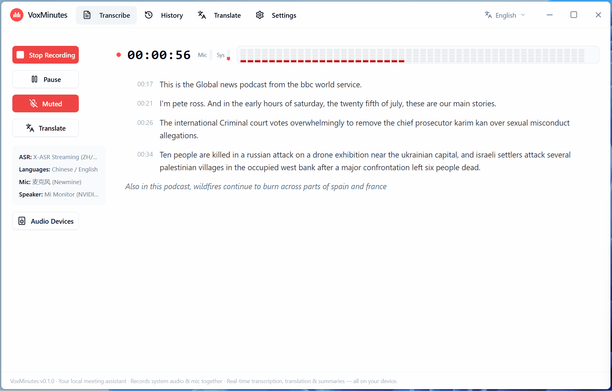

<div align="center">


# VoxMinutes

**Your local meeting assistant · Core features free forever · Optional cloud models · Records system audio & mic together · Live transcription, translation into 13 languages, floating desktop subtitles & AI meeting notes — your data stays on-device in local mode**

<sub>您的本地会议助手 · 核心功能永久免费 · 系统声音与麦克风同步录制 · 实时转写、13 种语言翻译、桌面悬浮字幕与 AI 会议纪要，数据不出设备</sub>

<sub>로컬 회의 어시스턴트 · 핵심 기능 영구 무료 · 클라우드 모델 선택 지원 · 시스템 오디오와 마이크 동시 녹음 · 실시간 받아쓰기, 13개 언어 번역, 데스크톱 자막, AI 회의록 — 로컬 모드에서는 데이터가 기기 밖으로 나가지 않습니다</sub>

<sub>ローカル会議アシスタント · コア機能は永久無料 · クラウドモデルにも対応（任意）· システム音声とマイクを同時録音 · リアルタイム文字起こし・13言語翻訳・デスクトップ字幕・AI議事録。ローカルモードならデータはデバイスの外に出ません</sub>

**Official site (download / pricing / FAQ): [voxmin.top](https://voxmin.top/en/)**

**English | [中文](README.md) | [한국어](README.ko.md) | [日本語](README.ja.md)**

[](LICENSE)
[]()
[]()
[]()
[](https://github.com/Longt-audio/voxminutes/pulls)

🎙️ **Dual-channel recording** · 📝 **Live transcription** · 🌐 **13 languages** · 💬 **Desktop subtitles** · 🤖 **AI meeting notes**

### [⬇️ Download from the official site (recommended)](https://voxmin.top/en/#download)

[GitHub Releases (backup source)](https://github.com/Longt-audio/voxminutes/releases/latest) · [macOS version (coming soon)](#macos-version-coming-soon) · [View source](https://github.com/Longt-audio/voxminutes)

<sub>**Free · No account needed for local use · ~50 MB · AGPL-3.0** &nbsp;|&nbsp; 🪟 Windows 10 / 11 (available) · 🍎 macOS coming soon · 🐧 Linux planned — [vote on Issues](https://github.com/Longt-audio/voxminutes/issues) to move it up</sub>



*👆 Demo: dual-channel recording, live transcription, live translation and AI meeting notes. Want the full demo with sound? [60-second video](docs/promotion-v2/videos/voxminutes-v2-horizontal.mp4) or the [30-second cut](docs/promotion-v2/videos/voxminutes-v2-horizontal-short.mp4).*

</div>

---

> ## 🚀 v0.2.0 is out · Now Available
>
> This release does three things: **brings cloud models into the app, floats subtitles onto your desktop, and cleanly separates free from paid.**
>
> - 🪙 **Cloud models** — skip the multi-gigabyte downloads and call hosted models directly (Doubao / Qwen / MiMo / Deepgram, 30+ languages). You can even re-run the same meeting through a different model and compare
> - 💬 **Floating desktop subtitles** — a separate always-on-top subtitle window you can drag, with adjustable line count and font size
> - 💰 **Free locally, optional in the cloud** — local models are free forever with no limits on time or runs; credits are only spent when you deliberately choose a cloud model. **No subscription, no monthly plan, no auto-renewal**
>
> 👉 **[Download](https://voxmin.top/en/#download)** · **[GitHub Releases](https://github.com/Longt-audio/voxminutes/releases/latest)** · **[What's new](https://voxmin.top/en/#whatsnew)**

---

## Quick links

[What it is](#what-it-is) · [Why VoxMinutes](#why-voxminutes) · [Download & install](#download--install) · [Local or cloud](#local-or-cloud) · [Features](#features) · [Models](#models) · [Credits](#credits-optional) · [Build from source](#build-from-source) · [Roadmap](#roadmap) · [Privacy](#privacy) · [FAQ](#faq) · [Contributing](#contributing)

> 🌐 The official site **[voxmin.top](https://voxmin.top/en/)** has fuller descriptions, pricing and FAQ (in four languages).

---

## What it is

VoxMinutes is a **local-first** desktop meeting assistant (Windows, Tauri 2). It records your **system audio and microphone together** while transcribing live — many similar tools only capture the microphone.

Transcripts can be translated live into 13 languages, shown as floating desktop subtitles, and turned into AI meeting notes in one click. **Everything runs on your own computer — free and open source, forever. Switch to cloud models whenever you want more power.**

On first launch the built-in wizard helps you download or import the models you need (multi-source: GitHub, HuggingFace mirrors, ModelScope — or import local archives / GGUF files), or you can pick a cloud model and skip the download entirely.

|  |  |
|---|---|
| **13** live translation languages | **2** channels: system audio + mic |
| **100%** core features free | **0 bytes** uploaded in local mode |

## Why VoxMinutes

| Pain point | Typical tools | VoxMinutes |
|------|----------|------------|
| Cost | Otter.ai, Xunfei Tingjian: charged by the minute | **Local features free forever**, unlimited time and runs; cloud is optional and pay-as-you-go |
| Privacy | Audio uploaded to the cloud | **In local mode everything runs on your device**, 0 bytes uploaded |
| Recording | Mic only, or system audio only | **System audio + microphone recorded together**, auto-mixed |
| Transcription | Cloud-only, useless offline | **Two on-device streaming engines, fully offline**; switch to cloud when you want more power |
| Translation | Needs a separate translation app | **13 languages, sentence-level live translation** + floating desktop subtitles |
| Setup | Whisper-style tools need a terminal and config | **In-app model manager + first-run wizard**, no command line |
| Compatibility | Browser extensions are limited by audio permissions | **System-level capture, works with any meeting app** |

> Because it captures audio at the system level rather than hooking into one specific app, Zoom, Teams, Google Meet, Feishu, webinars, lectures, streams and podcasts all work — and so does walking into a room and recording a face-to-face discussion.

## Download & install

| Platform | Status | Download |
|---|---|---|
| 🪟 **Windows 10 / 11** | ✅ **Available** | **① Official site (recommended)**: [voxmin.top/en/#download](https://voxmin.top/en/#download)<br>**② GitHub Releases (backup source)**: [releases/latest](https://github.com/Longt-audio/voxminutes/releases/latest) |
| 🍎 **macOS (Apple silicon)** | 🔜 **Coming soon** | Still in development — **no installer available yet**. [Star / watch the repo](https://github.com/Longt-audio/voxminutes) or [vote on Issues](https://github.com/Longt-audio/voxminutes/issues); we'll announce it here, on the site and in Releases |
| 🐧 **Linux** | 📋 Planned | [Vote on Issues](https://github.com/Longt-audio/voxminutes/issues) to help us prioritise |

<a id="macos-version-coming-soon"></a>

> **About macOS:** only the **Windows build is downloadable today**. The macOS version is still in development and **no installer exists yet** — anything labelled macOS on the site or in Releases should not be treated as an available download until it ships. When it does, this README, [the site](https://voxmin.top/en/) and [Releases](https://github.com/Longt-audio/voxminutes/releases) will all be updated together.

**Setup and first run:**

1. Download the Windows installer (~50 MB) from the **official site**, or from [Releases](https://github.com/Longt-audio/voxminutes/releases)
2. On launch the **first-run wizard** downloads or imports the ASR model (required) plus translation / summary models (optional) — or pick a cloud model and skip downloading
3. Choose your microphone and system audio, then hit record. Text appears live; turn on translation and desktop subtitles whenever you like
4. Generate AI notes in one click. From history you can search, edit and re-recognise, then export TXT / SRT / Markdown / PDF

> ⚠️ **Security prompts:** the installer is not code-signed yet, so your system will stop you once — that does not mean anything is wrong (the source is fully public, and you can build it yourself; see below).
> **Windows**: when SmartScreen shows a blue warning, click **More info → Run anyway**.
> **macOS** (once it ships): if it says the developer cannot be verified, right-click the app and choose **Open**, or allow it under **System Settings → Privacy & Security**.

## Local or cloud

One app, two engines. Use local for everyday meetings, switch to cloud for accuracy or more languages — you can change your mind at any time.

| | Local models | Cloud models |
|---|---|---|
| **Cost** | **Free forever**, unlimited time and runs | Credits deducted by actual usage |
| **Network** | **Fully offline** once models are downloaded | Needs a connection — direct from most regions |
| **Privacy** | Audio and text **never leave your computer** | Only the content you choose is sent to the server |
| **Setup** | One-time 0.5–2.5 GB model download | Nothing to download — pick one and go |
| **Best for** | Everyday meetings, privacy-sensitive work, offline use | Multilingual meetings, long sessions, maximum accuracy |

## Features

- **Dual-channel recording** — captures system audio and your microphone at the same time and mixes them automatically. Online calls, lectures, interviews and in-person discussions — you never miss either side.
- **Live streaming transcription** — two on-device engines, text streams out as people speak
  - `X-ASR` (Chinese/English, true streaming, 480 ms chunks, low latency)
  - `SenseVoice` (zh / en / ja / ko / Cantonese, VAD pseudo-streaming)
- **Live translation** — a sentence-by-sentence pipeline with streaming output, into 13 target languages
  - `OPUS-MT`: lightweight and fast, Chinese↔English
  - `Hy-MT2` (Tencent Hunyuan): higher quality, 13 target languages
- **Floating desktop subtitles** — an always-on-top subtitle window you can drag, with adjustable line count and font size (and up to 50 segments of history)
- **Read aloud (auxiliary)** — reads back **existing** transcripts and translations in **31 languages** with selectable voices (dedicated page, with preview and audio export); **not part of live transcription**
- **AI meeting notes** — a local GGUF LLM (Qwen / Gemma) writes topics, decisions and action items offline; or point it at your own API or web AI
- **History & search** — local SQLite, full-text search, inline editing of titles and segments, re-recognise with a different model
- **File transcription** — import audio files for offline transcription or re-recognition, and merge multiple recordings
- **Multi-format export** — TXT / SRT / Markdown / meeting notes, plus direct print-to-PDF
- **Model manager** — in-app downloads (multi-source, resumable, parallel) or local import, no command line needed
- **Multilingual UI** — English / 中文 / 한국어 / 日本語, switchable right from the welcome screen

## Models

### Local models (free · offline)

Every local model is **downloaded in-app or imported by you** — no models are bundled in the installer. Sources fall back automatically (official → regional mirrors), so mainland China works without a proxy.

| Model | Purpose | Size | Sources |
|------|------|------|--------|
| SenseVoice (sherpa-onnx) | ASR: zh / en / ja / ko / yue | ~854 MB | GitHub Releases / gh-proxy |
| X-ASR 480 ms (sherpa-onnx) | ASR: Chinese/English streaming | ~557 MB | GitHub Releases / gh-proxy |
| OPUS-MT zh→en / en→zh | Translation (fast) | ~113 MB each | HuggingFace / hf-mirror / ModelScope |
| Hy-MT2-1.8B (Tencent Hunyuan) | Translation (high quality, 13 target languages) | ~1.1 GB | HuggingFace / hf-mirror |
| Qwen2.5-3B-Instruct | Meeting notes (smaller, faster) | ~2.1 GB | HuggingFace / hf-mirror / ModelScope |
| Qwen3-4B-Instruct-2507 | Meeting notes (better quality) | ~2.5 GB | HuggingFace / hf-mirror |
| Gemma-3-4B-it | Meeting notes (strong in English) | ~2.5 GB | HuggingFace / hf-mirror |

Notes:

- All models are Q4/int8 quantised and **run on CPU alone** — no dedicated GPU needed (8+ threads recommended). Local live translation takes about 2–4 seconds per sentence; ASR runs at roughly RTF ≈ 0.25
- Model files live in the app's model directory; view, delete or import them from Settings (`.tar.bz2` / `.tar.gz` / `.zip` archives or `.gguf` files)
- Only the models listed above are supported; custom models are not yet supported

### Cloud models (optional · pay with credits)

Nothing to download — pick one and go. Covers **30+ languages**:

| Model | Best for |
|---|---|
| Doubao | Chinese meetings |
| Qwen | Mixed-language meetings |
| MiMo | Everyday use at a lower cost |
| Deepgram | English / overseas scenarios |

You can re-run the same meeting through a different model and compare the results, then keep whichever you prefer.

### Manual download

If in-app downloads are slow, copy the links into a download manager (IDM / aria2 / Thunder), then use **Settings → Models → Import** (supports `.tar.bz2` / `.tar.gz` / `.zip` archives, `.gguf` files, and model folders with all files present):

- **SenseVoice** (.tar.bz2): [GitHub](https://github.com/k2-fsa/sherpa-onnx/releases/download/asr-models/sherpa-onnx-sense-voice-zh-en-ja-ko-yue-2024-07-17.tar.bz2) / [gh-proxy mirror](https://gh-proxy.com/https://github.com/k2-fsa/sherpa-onnx/releases/download/asr-models/sherpa-onnx-sense-voice-zh-en-ja-ko-yue-2024-07-17.tar.bz2)
- **X-ASR 480 ms** (.tar.bz2): [GitHub](https://github.com/k2-fsa/sherpa-onnx/releases/download/asr-models/sherpa-onnx-x-asr-480ms-streaming-zipformer-transducer-zh-en-punct-2026-06-05.tar.bz2) / [gh-proxy mirror](https://gh-proxy.com/https://github.com/k2-fsa/sherpa-onnx/releases/download/asr-models/sherpa-onnx-x-asr-480ms-streaming-zipformer-transducer-zh-en-punct-2026-06-05.tar.bz2)
- **OPUS-MT zh→en** (needs `encoder_model_int8.onnx`, `decoder_model_merged_int8.onnx`, `tokenizer.json`): [HuggingFace](https://huggingface.co/Xenova/opus-mt-zh-en) / [ModelScope](https://modelscope.cn/models/Xenova/opus-mt-zh-en); **en→zh**: [HuggingFace](https://huggingface.co/Xenova/opus-mt-en-zh) / [ModelScope](https://modelscope.cn/models/Xenova/opus-mt-en-zh)
- **Hy-MT2-1.8B** (.gguf): [HuggingFace](https://huggingface.co/tencent/Hy-MT2-1.8B-GGUF/resolve/main/Hy-MT2-1.8B-Q4_K_M.gguf) / [hf-mirror](https://hf-mirror.com/tencent/Hy-MT2-1.8B-GGUF/resolve/main/Hy-MT2-1.8B-Q4_K_M.gguf)
- **Qwen2.5-3B-Instruct** (.gguf): [HuggingFace](https://huggingface.co/Qwen/Qwen2.5-3B-Instruct-GGUF/resolve/main/qwen2.5-3b-instruct-q4_k_m.gguf) / [hf-mirror](https://hf-mirror.com/Qwen/Qwen2.5-3B-Instruct-GGUF/resolve/main/qwen2.5-3b-instruct-q4_k_m.gguf) / [ModelScope](https://modelscope.cn/models/Qwen/Qwen2.5-3B-Instruct-GGUF/resolve/master/qwen2.5-3b-instruct-q4_k_m.gguf)
- **Qwen3-4B-Instruct-2507** (.gguf): [HuggingFace](https://huggingface.co/bartowski/Qwen_Qwen3-4B-Instruct-2507-GGUF/resolve/main/Qwen_Qwen3-4B-Instruct-2507-Q4_K_M.gguf) / [hf-mirror](https://hf-mirror.com/bartowski/Qwen_Qwen3-4B-Instruct-2507-GGUF/resolve/main/Qwen_Qwen3-4B-Instruct-2507-Q4_K_M.gguf)
- **Gemma-3-4B-it** (.gguf): [HuggingFace](https://huggingface.co/bartowski/google_gemma-3-4b-it-GGUF/resolve/main/google_gemma-3-4b-it-Q4_K_M.gguf) / [hf-mirror](https://hf-mirror.com/bartowski/google_gemma-3-4b-it-GGUF/resolve/main/google_gemma-3-4b-it-Q4_K_M.gguf)

## Credits (optional)

**Free locally, pay-as-you-go in the cloud.** Credits are only spent on cloud models — speech recognition, live translation, meeting summaries and read-aloud all share one balance.

| Pack | Price | Roughly | Best for |
|---|---|---|---|
| Starter | **¥10 / 200 credits** | ≈ 4–7 hours of full meetings | Trying the cloud models out |
| Standard (most popular) | **¥30 / 620 credits** | ≈ 11–23 hours of full meetings | Long or multilingual meetings |
| Value | **¥50 / 1100 credits** | ≈ 20–40 hours of full meetings | Lowest cost per credit |

- Hours are estimated for a typical 1-hour meeting running recognition + live translation + summary: about **54 credits/hour** with a realtime streaming model, or about **26 credits/hour** with the cheapest model — so **26–54 credits/hour** depending on what you pick
- **No subscription, no monthly plan, no auto-renewal.** **Purchased credits are valid for 1 year from the date of purchase**, and each top-up extends it
- New users get **100 credits free** (about 2–4 hours of full meetings); gifted credits are valid for 90 days from the day they are claimed
- Alipay / WeChat / PayPal. Codes are issued automatically after payment — paste yours in the app under **Account → Top up / Redeem**
- Your balance is tied to your account, so **switching computers or reinstalling will not lose it**
- 👉 Current pricing on the official site: **[voxmin.top/en/#pricing](https://voxmin.top/en/#pricing)**

## Screens

- **Live transcription** — recording controls, live text, inline translations and floating desktop subtitles (see the demo above)
- **History** — list / full-text search / detail editing / export / AI notes
- **Translate** — type and translate instantly, 13 target languages
- **Read aloud** — pick a language and voice, preview and export audio
- **Settings** — models (download / import / delete), audio & export, API, advanced

## Build from source

Requirements: Windows 10/11 x64, Git, Node.js LTS, pnpm, Rust 1.77+, CMake, VS2022 Build Tools (macOS / Linux support is planned).

```bash
git clone https://github.com/Longt-audio/voxminutes.git
cd voxminutes/frontend
pnpm install --ignore-workspace
pnpm build
pnpm tauri:dev
```

**Two sidecars must be provided locally** (large and platform-specific, so they are not committed):

- **ffmpeg**: `cargo check` / `pnpm tauri:dev` expect `frontend/src-tauri/binaries/ffmpeg-<target-triple>[.exe]`
  - Windows: `powershell -File frontend/scripts/prepare-windows-sidecars.ps1` (downloads ffmpeg.exe and builds llama-helper.exe)
  - macOS: symlink your local ffmpeg, e.g.
    `ln -sf "$(which ffmpeg)" frontend/src-tauri/binaries/ffmpeg-aarch64-apple-darwin`
- **llama-helper** (local LLM: Hy-MT2 translation / local meeting notes; needs libclang to build):

```powershell
$env:LIBCLANG_PATH = "<repo root>\.tooling\llvm\bin"
cargo build -p llama-helper --release
copy target\release\llama-helper.exe frontend\src-tauri\binaries\llama-helper-x86_64-pc-windows-msvc.exe
```

More commands in [docs/DEV_COMMANDS.md](docs/DEV_COMMANDS.md).

## Tech stack

| Layer | Tech |
|----|------|
| Desktop | Tauri 2 + Next.js (static export) + React + Tailwind CSS |
| System | Rust |
| ASR | sherpa-onnx (SenseVoice / X-ASR, ONNX Runtime); optional cloud ASR |
| Translation | OPUS-MT (ONNX Runtime) / Hy-MT2 (llama.cpp sidecar); optional cloud translation |
| Summaries | llama.cpp sidecar (GGUF, Qwen / Gemma) + any OpenAI-compatible API |
| Storage | SQLite |

## Roadmap

| Version | Goals |
|------|------|
| v0.1.0 | Live/offline transcription, two translation engines, local meeting notes, history & export, model download/import, first-run wizard |
| **v0.2.0 (current)** | **Cloud models (optional), floating desktop subtitles, read aloud, audio import / recording merge, credits system and a redesigned onboarding wizard** |
| v0.3.0 | Select-to-translate, push-to-talk interpretation, live summaries, speaker diarisation |
| Later | macOS / Linux builds, team collaboration |

> 💡 Want macOS / Linux or speaker diarisation sooner? Open an issue or vote on an existing one — the roadmap follows community demand.

## Privacy

By default, audio, transcripts, translations and summaries are **produced entirely on your device**; local mode uploads nothing to any server.

Only when you **deliberately choose a cloud model** (remote speech recognition / translation / summary / read-aloud) is the relevant audio or text forwarded through our servers to the upstream AI provider, together with usage and billing records. You can switch back to local models at any time.

Full details in the **[Privacy Policy](https://voxmin.top/en/privacy.html)** and **[Terms of Service](https://voxmin.top/en/terms.html)**.

## FAQ

<details>
<summary><b>Is VoxMinutes free?</b></summary>

The core app is completely free and open source (AGPL-3.0). Local transcription, translation, meeting summaries and desktop subtitles have no time or usage limits, and local use needs **no account**. Credits are only spent when you deliberately choose a **cloud model** — billed by actual usage, with no subscription, no monthly plan and no auto-renewal. New users also get 100 free credits to try it out.
</details>

<details>
<summary><b>Does it need the internet? Is my data uploaded?</b></summary>

With local models, once the models are downloaded the app works **fully offline** — audio, transcripts, translations and summaries are produced on your own computer and never leave it. Only when you deliberately pick a cloud model is the relevant audio or text sent to a server; local features are unaffected either way.
</details>

<details>
<summary><b>Do I need a dedicated GPU?</b></summary>

No. Every model is quantised and **runs on CPU alone**; 8 threads or more is recommended. Local live transcription runs at roughly RTF 0.25, and local live translation takes about 2–4 seconds per sentence.
</details>

<details>
<summary><b>Which operating systems are supported?</b></summary>

**Windows 10 / 11 is available today.** **macOS (Apple silicon) is coming soon** and Linux is planned — vote on GitHub Issues to help us prioritise.
</details>

<details>
<summary><b>Which meeting apps does it work with?</b></summary>

It captures audio at the **system level** rather than hooking into one specific app, so Zoom, Teams, Google Meet, Feishu, webinars, lectures, streams and podcasts all work — and so does walking into a room and recording a face-to-face discussion.
</details>

<details>
<summary><b>My system warns me about the installer. What should I do?</b></summary>

The installers are not code-signed yet, so your system will stop you once — that does not mean anything is wrong. The source is fully public and you can build it yourself following the steps above.
**Windows**: when SmartScreen shows a blue warning, click **More info → Run anyway**.
</details>

<details>
<summary><b>How long do 100 credits last? Where do I enter the code?</b></summary>

A typical 1-hour meeting running recognition + translation + summary costs roughly **26–54 credits** depending on the model, so 100 credits is about **2–4 hours of full meetings**; plain file transcription goes considerably further.

Buy a credit pack on the [official site](https://voxmin.top/en/#pricing) and the code appears automatically once payment completes — paste it in the app under **Account → Top up / Redeem**. Your balance is tied to your account, so switching computers or reinstalling will not lose it.
</details>

> More questions answered on the official site: **[FAQ](https://voxmin.top/en/#faq)** (four languages).

## License

**AGPL-3.0** — see [LICENSE](LICENSE).

## Contributing

Issues and pull requests are welcome. Before submitting, please make sure `cargo check --workspace`, `cargo test` and `cd frontend && pnpm build` all pass.

- 🐛 Bugs / feature requests: [Issues](https://github.com/Longt-audio/voxminutes/issues)
- 💬 Questions / ideas: [Discussions](https://github.com/Longt-audio/voxminutes/discussions)
- ⭐ If VoxMinutes helps you, **star the repo** — it helps others find it!

---

<div align="center">

**Official site [voxmin.top](https://voxmin.top/en/)** · [Download](https://voxmin.top/en/#download) · [Pricing](https://voxmin.top/en/#pricing) · [FAQ](https://voxmin.top/en/#faq) · [Privacy](https://voxmin.top/en/privacy.html) · [Terms](https://voxmin.top/en/terms.html)

**VoxMinutes** — Your voice, your data.

</div>
