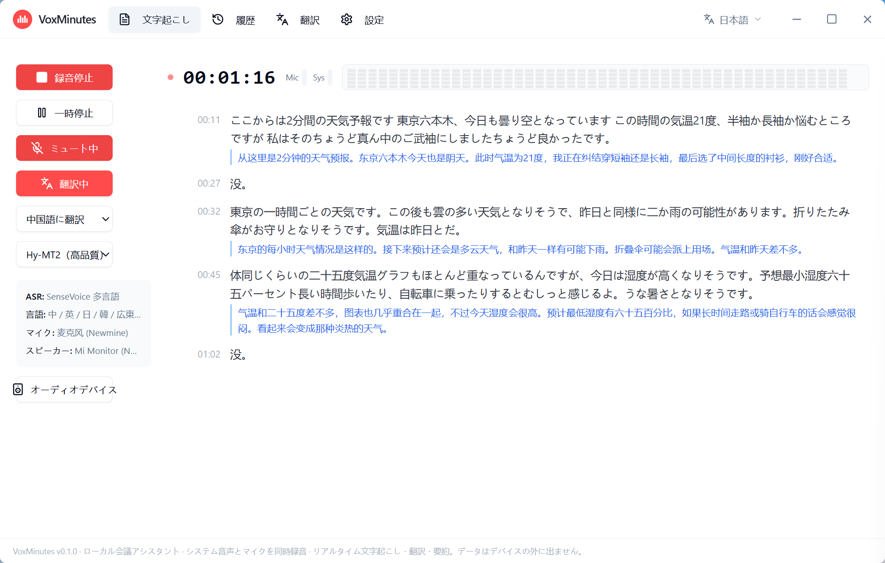

<div align="center">


# VoxMinutes

**ローカル会議アシスタント · システム音声とマイクを同時録音 · リアルタイム文字起こし・翻訳・要約。データはデバイスの外に出ません。**

**[English](README.md) | [中文](README.zh-CN.md) | [한국어](README.ko.md) | 日本語**

[](LICENSE)
[]()
[]()



</div>

---

## 概要

VoxMinutes は**ローカルファースト**のデスクトップアプリ（Windows、Tauri 2）です。会議をリアルタイムで文字起こししながら、**システム再生音とマイク入力を同時に**録音できます — 多くの類似ツールはマイク入力にしか対応していません。文字起こし結果は 13 言語へリアルタイム翻訳でき、AI 議事録もワンクリックで生成。すべてのモデルがあなたのコンピュータ上で動作し、**音声とテキストはデバイスの外に一切出ません**。

初回起動時には内蔵のセットアップウィザードが、必要なモデルのダウンロードまたはインポートを案内します（GitHub / HuggingFace ミラー / ModelScope のマルチソースダウンロード、ローカルの圧縮ファイル / GGUF ファイルのインポートに対応）。

## 主な機能

- **リアルタイム・ストリーミング文字起こし**：2 つのローカル ASR エンジンから選択
  - `X-ASR` — 中英バイリンガルの完全ストリーミング、480ms チャンク、低遅延
  - `SenseVoice` — 多言語（中/英/日/韓/広東語）、VAD 疑似ストリーミング
- **デュアルチャンネル録音**：システム再生 + マイクを同時録音、自動ミックス
- **リアルタイム翻訳**：文単位のパイプライン、訳文をトークン単位でストリーミング表示
  - `OPUS-MT` — 軽量・高速、中英翻訳
  - `Hy-MT2`（Tencent Hunyuan）— 高品質、**13 のターゲット言語**
- **AI 議事録**：ローカル GGUF LLM（Qwen / Gemma）でオフライン要約。リモート API や Web AI も利用可能。結果は専用パネルに表示、Markdown でエクスポート
- **翻訳ページ**：テキストを入力して即翻訳、ソース言語は自動判定
- **履歴**：SQLite 保存、検索・タイトル/段落のインライン編集
- **ファイル文字起こし**：音声ファイルのインポート、別エンジンでの再認識
- **エクスポート**：TXT / SRT / Markdown / 議事録 Markdown
- **モデルマネージャー**：アプリ内ダウンロード（マルチソース・レジューム・並列）またはローカルインポート、コマンドライン不要
- **多言語 UI**：English / 中文 / 한국어 / 日本語、ウェルカム画面で切り替え可能

## モデルサポート

すべてのモデルは**アプリ内ダウンロードまたはユーザーによるインポート**で導入し、インストーラーにはモデルを同梱していません。ダウンロードソースは順番に自動フォールバック（公式 → ミラー）するため、中国本土のネットワークでもそのまま利用できます。

| モデル | 用途 | サイズ | ダウンロードソース |
|--------|------|--------|------------------|
| SenseVoice（sherpa-onnx） | ASR：中/英/日/韓/広東語 | ~854 MB | GitHub Releases / gh-proxy |
| X-ASR 480ms（sherpa-onnx） | ASR：中英ストリーミング | ~557 MB | GitHub Releases / gh-proxy |
| OPUS-MT 中→英 / 英→中 | 翻訳（高速） | 各 ~113 MB | HuggingFace / hf-mirror / ModelScope |
| Hy-MT2-1.8B（Tencent Hunyuan） | 翻訳（高品質、13 言語） | ~1.1 GB | HuggingFace / hf-mirror |
| Qwen2.5-3B-Instruct | 議事録（小型・高速） | ~2.1 GB | HuggingFace / hf-mirror / ModelScope |
| Qwen3-4B-Instruct-2507 | 議事録（より高品質） | ~2.5 GB | HuggingFace / hf-mirror |
| Gemma-3-4B-it | 議事録（英語に強い） | ~2.5 GB | HuggingFace / hf-mirror |

補足：

- すべてのモデルは Q4/int8 量子化済みで、**CPU のみで動作**します（8 スレッドのマシンで Hy-MT2 は 1 文あたり約 2〜4 秒）；ASR の実時間係数（RTF）≈ 0.25
- モデルファイルはアプリのモデルディレクトリに保存され、設定画面で確認・削除・インポート（`.tar.bz2` / `.tar.gz` / `.zip` 圧縮ファイルまたは `.gguf` ファイル）が可能です
- 上記の登録済みモデルのみサポートし、カスタムモデルには現時点で対応していません

## 画面構成

- **文字起こし**：録音コントロール + リアルタイムテキスト + インライン翻訳（上のデモ参照）
- **履歴**：一覧 / 検索 / 詳細編集 / エクスポート / AI 議事録
- **翻訳**：入力して即翻訳、13 のターゲット言語
- **設定**：モデル（ダウンロード/インポート/削除）、オーディオとエクスポート、API、詳細

## ダウンロードとインストール

1. [Releases](../../releases) から最新の Windows インストーラー（またはポータブルパッケージ）をダウンロード
2. インストールして起動すると、**セットアップウィザード**が自動的に表示され、ASR モデル（必須）と翻訳・議事録モデル（任意）のダウンロードまたはインポートを案内します
3. モデルは後から **設定 → モデル** でいつでもダウンロード / インポート / 削除できます

> ヒント：中国本土ではプロキシ不要で、ダウンロードソースが自動的に利用可能なミラー（hf-mirror / gh-proxy / ModelScope）にフォールバックします。

## ソースからビルド

必要環境：Windows 10/11 x64、Git、Node.js LTS、pnpm、Rust 1.77+、CMake、VS2022 Build Tools（macOS / Linux は対応予定）。

```bash
git clone https://github.com/Longt-audio/voxminutes.git
cd voxminutes/frontend
pnpm install --ignore-workspace
pnpm build
pnpm tauri:dev
```

ローカル LLM 機能（Hy-MT2 翻訳 / ローカル議事録）を使うには、llama-helper サイドカーもビルドします（libclang が必要）：

```powershell
$env:LIBCLANG_PATH = "<リポジトリルート>\.tooling\llvm\bin"
cargo build -p llama-helper --release
copy target\release\llama-helper.exe frontend\src-tauri\binaries\llama-helper-x86_64-pc-windows-msvc.exe
```

その他の開発コマンドは [docs/DEV_COMMANDS.md](docs/DEV_COMMANDS.md) を参照してください。

## 技術スタック

| レイヤー | 技術 |
|----------|------|
| デスクトップ | Tauri 2 + Next.js（静的エクスポート）+ React + Tailwind CSS |
| システム | Rust |
| ASR | sherpa-onnx（SenseVoice / X-ASR、ONNX Runtime） |
| 翻訳 | OPUS-MT（ONNX Runtime）/ Hy-MT2（llama.cpp サイドカー） |
| 議事録 | llama.cpp サイドカー（GGUF、Qwen / Gemma）+ OpenAI 互換リモート API |
| データベース | SQLite |

## ロードマップ

| バージョン | 目標 |
|-----------|------|
| v0.1.0（現在の MVP） | リアルタイム/ファイル文字起こし、デュアルエンジン翻訳、ローカル議事録、履歴とエクスポート、モデルのダウンロード/インポート、セットアップウィザード |
| v0.2.0 | TTS、字幕フローティングウィンドウ、選択テキスト翻訳 |
| v0.3.0 | プッシュトゥートーク同時通訳、リアルタイム要約、話者分離 |
| 将来（有償版） | クラウド高精度 ASR、チームワークスペース |

## プライバシー

録音、文字起こし、翻訳、要約はすべてお使いのデバイス上で処理されます。リモート議事録 API を自分で設定しない限り、アプリがサーバーとコンテンツをやり取りすることはありません。

## ライセンス

本プロジェクトは **AGPL-3.0** ライセンスです。詳細は [LICENSE](LICENSE) を参照してください。

## コントリビューション

Issue と Pull Request を歓迎します。提出前に `cargo check --workspace`、`cargo test`、`cd frontend && pnpm build` が通ることを確認してください。

---

**VoxMinutes** — あなたの声、あなたのデータ。
