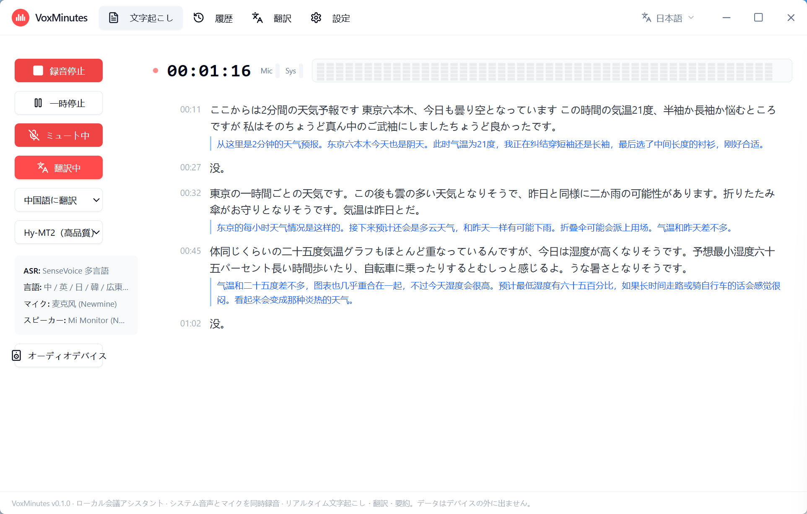

<div align="center">


# VoxMinutes

**ローカル会議アシスタント · コア機能は永久無料 · クラウドモデルにも対応（任意）· システム音声とマイクを同時録音 · リアルタイム文字起こし・13言語翻訳・デスクトップ字幕・AI議事録。ローカルモードならデータはデバイスの外に出ません**

<sub>Your local meeting assistant · Core features free forever · Optional cloud models · Records system audio & mic together · Live transcription, translation into 13 languages, floating desktop subtitles & AI meeting notes — your data stays on-device in local mode</sub>

<sub>로컬 회의 어시스턴트 · 핵심 기능 영구 무료 · 클라우드 모델 선택 지원 · 시스템 오디오와 마이크 동시 녹음 · 실시간 받아쓰기, 13개 언어 번역, 데스크톱 자막, AI 회의록 — 로컬 모드에서는 데이터가 기기 밖으로 나가지 않습니다</sub>

<sub>您的本地会议助手 · 核心功能永久免费 · 系统声音与麦克风同步录制 · 实时转写、13 种语言翻译、桌面悬浮字幕与 AI 会议纪要，数据不出设备</sub>

**公式サイト（ダウンロード / クレジット / よくある質問）：[voxmin.top](https://voxmin.top/ja/)**

**[English](README.en.md) | [中文](README.md) | [한국어](README.ko.md) | 日本語**

[](LICENSE)
[]()
[]()
[]()
[](https://github.com/Longt-audio/voxminutes/pulls)

🎙️ **2系統の同時録音** · 📝 **リアルタイム文字起こし** · 🌐 **13言語翻訳** · 💬 **デスクトップ字幕** · 🤖 **AI議事録**

### [⬇️ 公式サイトからダウンロード（推奨）](https://voxmin.top/ja/#download)

[GitHub Releases（予備）](https://github.com/Longt-audio/voxminutes/releases/latest) · [macOS 版（近日公開）](#macos-版近日公開) · [ソースを見る](https://github.com/Longt-audio/voxminutes)

<sub>**無料 · ローカル利用はアカウント登録不要 · 約 50 MB · AGPL-3.0 オープンソース** &nbsp;|&nbsp; 🪟 Windows 10 / 11（正式サポート）· 🍎 macOS 近日公開 · 🐧 Linux 計画中 — [Issues で投票](https://github.com/Longt-audio/voxminutes/issues)して優先順位づけにご協力ください</sub>



*👆 アニメーションデモ：2系統の同時録音、リアルタイム文字起こし、リアルタイム翻訳、AI議事録。音声付きのフルデモは [60 秒動画](docs/promotion-v2/videos/voxminutes-v2-horizontal.mp4) または [30 秒ハイライト版](docs/promotion-v2/videos/voxminutes-v2-horizontal-short.mp4) でご覧ください。*

</div>

---

> ## 🚀 v0.2.0 リリース · Now Available
>
> 今回のアップデートは3つ：**クラウドの優良モデルをアプリに統合し、字幕をデスクトップに浮かべ、無料と有料をはっきり分けました。**
>
> - 🪙 **クラウド優良モデル** — 数 GB のモデルダウンロードを待つ必要はもうありません。クラウドの大規模モデルを直接呼び出せます（Doubao / Qwen / MiMo / Deepgram、30+ 言語）。同じ会議を別のモデルで再認識して比較することもできます
> - 💬 **デスクトップ字幕** — 常に最前面に浮かぶ独立した字幕ウィンドウ。ドラッグで移動でき、行数と文字サイズも調整可能。外国語の会議が字幕付きの動画のように見られます
> - 💰 **ローカルは無料・クラウドは任意** — ローカルモデルは永久無料で、時間制限も回数制限もありません。クレジットを消費するのは、自分でクラウドモデルを選んだときだけ。**サブスクなし・月額なし・自動更新なし**
>
> 👉 **[公式サイトからダウンロード](https://voxmin.top/ja/#download)** · **[GitHub Releases](https://github.com/Longt-audio/voxminutes/releases/latest)** · **[新バージョン](https://voxmin.top/ja/#whatsnew)**

---

## クイックリンク

[VoxMinutes とは](#voxminutes-とは) · [VoxMinutes を選ぶ理由](#voxminutes-を選ぶ理由) · [ダウンロードとインストール](#ダウンロードとインストール) · [ローカルかクラウドか](#ローカルかクラウドか) · [主な機能](#主な機能) · [モデルサポート](#モデルサポート) · [クレジット購入](#クレジット購入任意) · [ソースからビルド](#ソースからビルド) · [ロードマップ](#ロードマップ) · [プライバシー](#プライバシー) · [よくある質問](#よくある質問) · [コントリビューション](#コントリビューション)

> 🌐 公式サイト **[voxmin.top](https://voxmin.top/ja/)** には、より詳しい紹介・クレジット・よくある質問があります（4言語対応）。

---

## VoxMinutes とは

VoxMinutes は**ローカルファースト**のデスクトップ会議アシスタントです（Windows、Tauri 2）。会議をしながらリアルタイムで文字起こしし、同時に**システム音声とマイク入力を2系統同時に録音**します —— 多くの類似ツールはマイク入力にしか対応していません。

文字起こし結果はリアルタイムで13言語に翻訳でき、デスクトップ字幕として表示し、ワンクリックで AI 議事録を生成できます。**主要機能はすべてあなたの PC 上で動作します —— ローカルは永久無料・オープンソース。もっと高い精度が必要なときは、クラウドの優良モデルを必要な分だけ選べます。**

初回起動時には内蔵のウィザードが、必要なモデルのダウンロードまたはインポートを案内します（GitHub / HuggingFace ミラー / ModelScope のマルチソースダウンロード、ローカルの圧縮ファイル / GGUF ファイルのインポートに対応）。クラウドモデルを選べば、ダウンロードを丸ごと省略できます。

|  |  |
|---|---|
| **13 言語** リアルタイム翻訳 | **2系統** システム音声 + マイクを同時録音 |
| **100%** 主要機能は永久無料 | **0 バイト** ローカル動作時の送信量 |

## VoxMinutes を選ぶ理由

| 課題 | 一般的なツール | VoxMinutes |
|------|----------|------------|
| 費用 | Otter.ai、訊飛聴見：分単位の課金 | **ローカル機能は永久無料**、時間も回数も無制限。クラウドは任意で従量課金 |
| プライバシー | 音声をクラウドにアップロード | **ローカルモードではすべてが自分のデバイス上で動作**、送信量 0 バイト |
| 録音 | マイクのみ、またはシステム音声のみ | **システム音声 + マイクを同時録音**、自動ミックス |
| 文字起こし | クラウド認識のみで、オフラインでは使えない | **ローカル2エンジンのストリーミング認識で完全オフライン**。より高い精度が必要なときはクラウドへ |
| 翻訳 | 別の翻訳アプリを開く必要がある | **13 言語の文単位リアルタイム翻訳** + デスクトップ字幕 |
| 導入の手間 | Whisper 系ツールはコマンドライン / 環境構築が必要 | **アプリ内モデルマネージャー + 初回起動ウィザード**、ターミナル不要 |
| 互換性 | ブラウザ拡張は音声権限の制限を受ける | **システムレベルでキャプチャ、あらゆる会議アプリに対応** |

> システムレベルで音声をキャプチャし、特定のアプリに依存しないため、Zoom、Tencent Meeting（騰訊会議）、Feishu（飛書）、Teams、Google Meet、オンライン講義、配信、インタビューなど、どれでも録音できます。ノート PC を会議室に持ち込んで対面の打ち合わせを録音することも可能です。

## ダウンロードとインストール

| プラットフォーム | 状態 | ダウンロード |
|---|---|---|
| 🪟 **Windows 10 / 11** | ✅ **正式サポート** | **① 公式サイト（推奨）**：[voxmin.top/ja/#download](https://voxmin.top/ja/#download)<br>**② GitHub Releases（予備）**：[releases/latest](https://github.com/Longt-audio/voxminutes/releases/latest) |
| 🍎 **macOS（Apple シリコン）** | 🔜 **近日公開** | 開発中のため**インストーラーはまだありません**。[リポジトリに Star / Watch](https://github.com/Longt-audio/voxminutes) するか [Issues](https://github.com/Longt-audio/voxminutes/issues) で投票してください。公開時は Releases と公式サイトでお知らせします |
| 🐧 **Linux** | 📋 計画中 | [Issues](https://github.com/Longt-audio/voxminutes/issues) での投票が優先順位づけの参考になります |

<a id="macos-版近日公開"></a>

> **macOS 版について**：現在ダウンロードできるのは **Windows 版のみ**です。macOS 版は開発中で、**インストーラーはまだ提供していません**。
> 公式サイトや Releases で macOS と表示されているものでも、正式リリース前は利用可能なダウンロードとして扱わないでください。リリース後は本 README、[公式サイト](https://voxmin.top/ja/)、[Releases](https://github.com/Longt-audio/voxminutes/releases) を同時に更新します。

**インストールと初回起動：**

1. **公式サイト**から Windows インストーラー（約 50 MB）をダウンロードしてダブルクリックでインストールします。[Releases](https://github.com/Longt-audio/voxminutes/releases) からもダウンロードできます
2. 起動すると**初回起動ウィザード**が自動的に表示され、ASR モデル（必須）と翻訳・要約モデル（任意）のダウンロードまたはインポートを案内します。クラウドモデルを選べばダウンロードを省略できます
3. マイクとシステム音声を選んで録音を開始 —— 文字がリアルタイムで表示され、翻訳・デスクトップ字幕はいつでも有効にできます
4. 終了後にワンクリックで AI 議事録を生成。履歴から全文検索・編集・再認識ができ、TXT / SRT / Markdown / PDF に書き出せます

> ⚠️ **セキュリティに関する注意**：インストーラーはまだコード署名証明書を取得していないため、システムが一度警告を出します。これはソフトウェアに問題があるという意味ではありません（ソースは完全公開で、以下の手順で自分でビルドすることもできます）。
> **Windows**：SmartScreen の青い警告が出たら「詳細情報 → 実行」をクリックしてください。
> **macOS**（リリース後）：「開発元を確認できません」と表示されたら、アプリを右クリックして「開く」を選ぶか、「システム設定 → プライバシーとセキュリティ」で許可してください。

## ローカルかクラウドか

1つのアプリに2つのエンジン。普段の会議はローカル、精度や多言語が必要なときはクラウド。いつでも切り替えられます。

| 項目 | ローカルモデル | クラウドモデル |
|---|---|---|
| **費用** | **永久無料**、時間も回数も無制限 | 実際の使用量に応じてクレジットを消費 |
| **ネットワーク** | モデルのダウンロードが終われば**完全にオフライン** | 接続が必要、多くの地域から直結可能 |
| **プライバシー** | 音声もテキストも**PC の外に出ません** | 選んだ内容だけがサーバーへ送信されます |
| **準備コスト** | 初回のみ 0.5〜2.5 GB のモデルをダウンロード | ダウンロード不要、選んですぐ使えます |
| **向いている用途** | 日常の会議、機密性の高い用途、オフライン環境 | 多言語会議、長時間会議、認識精度を重視する場合 |

## 主な機能

- **2系統の同時録音**：システム音声とマイクを同時に取り込み、自動でミックス。オンライン会議、オンライン講義、インタビュー、対面の打ち合わせまで、どちらの声も漏らしません。
- **リアルタイム・ストリーミング文字起こし**：2つのローカル ASR エンジンから選択でき、話した瞬間に文字が出ます
  - `X-ASR`（中英バイリンガルの完全ストリーミング、480ms チャンク、低遅延）
  - `SenseVoice`（中/英/日/韓/広東語の多言語、VAD 疑似ストリーミング）
- **リアルタイム翻訳**：文単位のパイプライン、訳文をトークン単位でストリーミング表示、13 のターゲット言語
  - `OPUS-MT`：軽量・高速、中英翻訳
  - `Hy-MT2`（Tencent Hunyuan）：より高品質、13 のターゲット言語
- **デスクトップ字幕**：常に最前面に浮かぶ独立した字幕ウィンドウ。ドラッグで移動でき、行数と文字サイズを調整可能（直近 50 セグメントまで遡れます）。外国語の会議が字幕付きの動画のように見られます
- **読み上げ（補助機能）**：**既存の**文字起こし・訳文を読み上げます。**31 言語**に対応し、音色も選択可能（専用ページで試聴・音声の保存）——**リアルタイム文字起こしには介在しません**
- **AI 議事録**：ローカル GGUF LLM（Qwen / Gemma）がトピック・結論・アクションアイテムをオフラインで生成。自分の API や Web AI をつなぐこともできます
- **履歴と検索**：ローカルの SQLite に保存、全文検索、タイトル/段落のインライン編集、別モデルでの再認識
- **ファイル文字起こし**：音声ファイルをインポートしてオフラインで文字起こし・再認識、複数の録音を結合
- **話者の識別と名前変更**：オフライン認識（ファイル文字起こし / 再認識）でクラウドの Doubao / Qwen モデルを使うと、異なる話者を自動で識別し、「誰が話しているか」ごとに段落へラベル付けします。履歴の詳細ページで話者名をクリックすれば（例：「張部長」「取引先」など）名前を変更でき、議事録で誰が何を発言したか一目で分かります
- **各種形式で書き出し**：TXT / SRT / Markdown / 議事録、PDF への直接印刷も可能
- **モデルマネージャー**：アプリ内ダウンロード（マルチソース + レジューム + 複数モデル並列）またはローカルインポート、コマンドライン不要
- **多言語 UI**：English / 中文 / 한국어 / 日本語、ウェルカム画面で切り替え可能

## モデルサポート

### ローカルモデル（無料・オフライン）

ローカルモデルはすべて**アプリ内ダウンロードまたはユーザー自身によるインポート**で導入し、インストーラーには一切同梱していません。ダウンロードソースは順番に自動フォールバック（公式 → ミラー）するため、中国本土のネットワークでもそのまま利用できます。

| モデル | 用途 | サイズ | ダウンロードソース |
|------|------|------|--------|
| SenseVoice（sherpa-onnx） | ASR：中/英/日/韓/広東語 | ~854 MB | GitHub Releases / gh-proxy |
| X-ASR 480ms（sherpa-onnx） | ASR：中英ストリーミング | ~557 MB | GitHub Releases / gh-proxy |
| OPUS-MT 中→英 / 英→中 | 翻訳（高速） | 各 ~113 MB | HuggingFace / hf-mirror / ModelScope |
| Hy-MT2-1.8B（Tencent Hunyuan） | 翻訳（高品質、13 のターゲット言語） | ~1.1 GB | HuggingFace / hf-mirror |
| Qwen2.5-3B-Instruct | 議事録（小型・高速） | ~2.1 GB | HuggingFace / hf-mirror / ModelScope |
| Qwen3-4B-Instruct-2507 | 議事録（より高品質） | ~2.5 GB | HuggingFace / hf-mirror |
| Gemma-3-4B-it | 議事録（英語に強い） | ~2.5 GB | HuggingFace / hf-mirror |

説明：

- すべてのモデルは Q4/int8 量子化済みで、**CPU のみで動作**します（独立した GPU は不要、8 スレッド以上を推奨）。Hy-MT2 のリアルタイム翻訳は1文あたり約 2〜4 秒、ASR のリアルタイム文字起こしは RTF ≈ 0.25
- モデルファイルはアプリのモデルディレクトリに保存され、設定画面で確認・削除・インポート（`.tar.bz2` / `.tar.gz` / `.zip` 圧縮ファイルまたは `.gguf` ファイル）ができます
- 上記の登録済みモデルのみサポートし、カスタムモデルには現時点で対応していません

### クラウドモデル（任意・クレジット従量課金）

モデルのダウンロードは不要、選んですぐ使えます。中英日韓など **30+ 言語**をカバー：

| モデル | 向いている用途 |
|---|---|
| Doubao（豆包） | 中国語の会議、話者識別 |
| Qwen（千問） | 多言語が混在する会議、話者識別 |
| MiMo | コストパフォーマンス重視の日常用途 |
| Deepgram | 英語のみ / 海外向け |

同じ会議を別のモデルで再認識して結果を比べ、良い方を選べます。

### 手動ダウンロード

アプリ内ダウンロードが遅い場合は、リンクをダウンロードマネージャー（迅雷 / IDM / aria2）にコピーし、完了後に「設定 → モデル」で「インポート」をクリックしてインストールしてください（`.tar.bz2` / `.tar.gz` / `.zip` 圧縮ファイル、`.gguf` ファイル、必要なファイルが揃ったモデルフォルダに対応）：

- **SenseVoice**（.tar.bz2）：[GitHub](https://github.com/k2-fsa/sherpa-onnx/releases/download/asr-models/sherpa-onnx-sense-voice-zh-en-ja-ko-yue-2024-07-17.tar.bz2) / [gh-proxy ミラー](https://gh-proxy.com/https://github.com/k2-fsa/sherpa-onnx/releases/download/asr-models/sherpa-onnx-sense-voice-zh-en-ja-ko-yue-2024-07-17.tar.bz2)
- **X-ASR 480ms**（.tar.bz2）：[GitHub](https://github.com/k2-fsa/sherpa-onnx/releases/download/asr-models/sherpa-onnx-x-asr-480ms-streaming-zipformer-transducer-zh-en-punct-2026-06-05.tar.bz2) / [gh-proxy ミラー](https://gh-proxy.com/https://github.com/k2-fsa/sherpa-onnx/releases/download/asr-models/sherpa-onnx-x-asr-480ms-streaming-zipformer-transducer-zh-en-punct-2026-06-05.tar.bz2)
- **OPUS-MT 中→英**（`encoder_model_int8.onnx`、`decoder_model_merged_int8.onnx`、`tokenizer.json` の3ファイルが必要）：[HuggingFace](https://huggingface.co/Xenova/opus-mt-zh-en) / [ModelScope](https://modelscope.cn/models/Xenova/opus-mt-zh-en)；**英→中**：[HuggingFace](https://huggingface.co/Xenova/opus-mt-en-zh) / [ModelScope](https://modelscope.cn/models/Xenova/opus-mt-en-zh)
- **Hy-MT2-1.8B**（.gguf）：[HuggingFace](https://huggingface.co/tencent/Hy-MT2-1.8B-GGUF/resolve/main/Hy-MT2-1.8B-Q4_K_M.gguf) / [hf-mirror ミラー](https://hf-mirror.com/tencent/Hy-MT2-1.8B-GGUF/resolve/main/Hy-MT2-1.8B-Q4_K_M.gguf)
- **Qwen2.5-3B-Instruct**（.gguf）：[HuggingFace](https://huggingface.co/Qwen/Qwen2.5-3B-Instruct-GGUF/resolve/main/qwen2.5-3b-instruct-q4_k_m.gguf) / [hf-mirror ミラー](https://hf-mirror.com/Qwen/Qwen2.5-3B-Instruct-GGUF/resolve/main/qwen2.5-3b-instruct-q4_k_m.gguf) / [ModelScope](https://modelscope.cn/models/Qwen/Qwen2.5-3B-Instruct-GGUF/resolve/master/qwen2.5-3b-instruct-q4_k_m.gguf)
- **Qwen3-4B-Instruct-2507**（.gguf）：[HuggingFace](https://huggingface.co/bartowski/Qwen_Qwen3-4B-Instruct-2507-GGUF/resolve/main/Qwen_Qwen3-4B-Instruct-2507-Q4_K_M.gguf) / [hf-mirror ミラー](https://hf-mirror.com/bartowski/Qwen_Qwen3-4B-Instruct-2507-GGUF/resolve/main/Qwen_Qwen3-4B-Instruct-2507-Q4_K_M.gguf)
- **Gemma-3-4B-it**（.gguf）：[HuggingFace](https://huggingface.co/bartowski/google_gemma-3-4b-it-GGUF/resolve/main/google_gemma-3-4b-it-Q4_K_M.gguf) / [hf-mirror ミラー](https://hf-mirror.com/bartowski/google_gemma-3-4b-it-GGUF/resolve/main/google_gemma-3-4b-it-Q4_K_M.gguf)

## クレジット購入（任意）

**ローカルは永久無料、クラウドは従量課金。** クレジットを消費するのはクラウドモデルを呼び出したときだけ —— 音声認識・リアルタイム翻訳・議事録・読み上げが同じ残高を共有します。

| クレジットパック | 価格 | 目安 | 向いている用途 |
|---|---|---|---|
| お試しパック | **¥10 / 200 クレジット** | 完全な会議 約4〜7時間分 | まずクラウドモデルの効果を試したい方に |
| スタンダード（一番人気） | **¥30 / 620 クレジット** | 完全な会議 約11〜23時間分 | 長時間・多言語の会議に |
| お得パック | **¥50 / 1100 クレジット** | 完全な会議 約20〜40時間分 | 1クレジットあたり最安 |

- 時間は「1時間の会議 = 音声認識 + リアルタイム翻訳 + 議事録」という構成で試算しています：リアルタイムストリーミングモデルで約 **54 クレジット/時間**、より安価なモデルで約 **26 クレジット/時間** なので、**26〜54 クレジット/時間** の幅で記載しています。実際の消費量は選択したモデルによって変わります
- **サブスクなし・月額なし・自動更新なし**。**購入したクレジットは購入日から1年間有効**で、追加チャージすると期間が延長されます
- 新規登録で **100 クレジット**を進呈（完全な会議 約2〜4時間分）。進呈分の有効期限は受け取り日から90日です
- Alipay / WeChat / PayPal に対応。支払い後は引き換えコードが自動発行され、アプリの「アカウント → チャージ／引き換え」に貼り付けると反映されます
- 残高はアカウントに紐づくので、**PC の買い替えやアプリの再インストールでも消えません**
- 👉 購入と最新価格は公式サイトをご確認ください：**[voxmin.top/ja/#pricing](https://voxmin.top/ja/#pricing)**

## 画面構成

- **リアルタイム文字起こし**：録音コントロール + リアルタイムテキスト + インライン訳文 + デスクトップ字幕（上のデモ参照）
- **履歴**：一覧 / 全文検索 / 詳細の編集 / 書き出し / AI 議事録
- **翻訳**：入力即翻訳、13 のターゲット言語
- **読み上げ**：言語と音色を選択、試聴、音声の保存
- **設定**：モデル（ダウンロード/インポート/削除）、オーディオと書き出し、API、詳細設定

## ソースからビルド

必要環境：Windows 10/11 x64、Git、Node.js LTS、pnpm、Rust 1.77+、CMake、VS2022 Build Tools（macOS / Linux は対応予定）。

```bash
git clone https://github.com/Longt-audio/voxminutes.git
cd voxminutes/frontend
pnpm install --ignore-workspace
pnpm build
pnpm tauri:dev
```

**2つのサイドカーはローカルで用意する必要があります**（サイズが大きくプラットフォーム依存のため、リポジトリには含めていません）：

- **ffmpeg**：`cargo check` / `pnpm tauri:dev` が `frontend/src-tauri/binaries/ffmpeg-<target-triple>[.exe]` を要求します
  - Windows：`powershell -File frontend/scripts/prepare-windows-sidecars.ps1`（ffmpeg.exe を自動ダウンロードし、llama-helper.exe をビルドします）
  - macOS：ローカルの `ffmpeg` をシンボリックリンクします。例：
    `ln -sf "$(which ffmpeg)" frontend/src-tauri/binaries/ffmpeg-aarch64-apple-darwin`
- **llama-helper**（ローカル LLM：Hy-MT2 翻訳 / ローカル議事録。ビルドには libclang が必要）：

```powershell
$env:LIBCLANG_PATH = "<リポジトリルート>\.tooling\llvm\bin"
cargo build -p llama-helper --release
copy target\release\llama-helper.exe frontend\src-tauri\binaries\llama-helper-x86_64-pc-windows-msvc.exe
```

その他の開発コマンドは [docs/DEV_COMMANDS.md](docs/DEV_COMMANDS.md) を参照してください。

## 技術スタック

| レイヤー | 技術 |
|----|------|
| デスクトップ | Tauri 2 + Next.js（静的エクスポート）+ React + Tailwind CSS |
| システム | Rust |
| ASR | sherpa-onnx（SenseVoice / X-ASR、ONNX Runtime）；任意のクラウド ASR |
| 翻訳 | OPUS-MT（ONNX Runtime）/ Hy-MT2（llama.cpp サイドカー）；任意のクラウド翻訳 |
| 議事録 | llama.cpp サイドカー（GGUF、Qwen / Gemma）+ OpenAI 互換リモート API |
| データベース | SQLite |

## ロードマップ

| バージョン | 目標 |
|------|------|
| v0.1.0 | リアルタイム/オフライン文字起こし、デュアルエンジン翻訳、ローカル議事録、履歴と書き出し、モデルのダウンロード/インポート、初回起動ガイド |
| **v0.2.0（最新）** | **クラウド優良モデル（任意）、デスクトップ字幕、読み上げ、音声インポート / 録音の結合、クレジット体系と初回起動ガイドの刷新** |
| v0.3.0 | 選択テキストの翻訳、プッシュトゥトーク同時通訳、リアルタイム要約、ローカル話者分離 |
| 将来 | macOS / Linux 版、チームコラボレーション |

> 💡 macOS / Linux や話者分離を早く使いたいですか？ Issue を立てるか既存 Issue に投票してください —— ロードマップの優先順位はコミュニティの需要に従います。

## プライバシー

既定では、音声・文字起こし・翻訳・要約は**すべてお使いのデバイス上で処理**され、ローカルモードではいかなるサーバーにも内容を送信しません。

**自分で「クラウド」モデルを選んだ場合**（リモートの音声認識 / 翻訳 / 要約 / 読み上げ）に限り、該当する音声またはテキストが当社のサーバーを経由して上流の AI サービス提供者へ転送され、利用量と課金の記録が生成されます。いつでもローカルモデルに戻せます。

データ処理の詳細は **[プライバシーポリシー](https://voxmin.top/en/privacy.html)** と **[利用規約](https://voxmin.top/en/terms.html)** をご覧ください。

## よくある質問

<details>
<summary><b>VoxMinutes は無料ですか？</b></summary>

主要機能は完全に無料でオープンソース（AGPL-3.0）です。ローカルの文字起こし・翻訳・議事録・デスクトップ字幕は時間制限も回数制限もなく、ローカル利用に**アカウント登録も不要**です。クレジットを消費するのは、自分で**クラウドモデル**を選んだときだけ —— 実際の使用量に応じた課金で、サブスク・月額・自動更新はありません。新規登録では 100 クレジットを進呈します。
</details>

<details>
<summary><b>ネット接続は必要ですか？データは送信されますか？</b></summary>

ローカルモデルの場合、モデルのダウンロードが終われば**完全にオフライン**で動作します。音声・文字起こし・翻訳・要約はすべてお使いの PC 上で処理され、デバイスの外には出ません。サーバーに送信されるのは、自分でクラウドモデルを選んだときの該当部分だけです。ローカル機能には影響しません。
</details>

<details>
<summary><b>専用の GPU は必要ですか？普通のノート PC でも動きますか？</b></summary>

GPU は不要です。すべてのモデルは量子化版で、**CPU だけで動作**します（8スレッド以上のマシンを推奨）。ローカルのリアルタイム文字起こしは RTF ≈ 0.25、ローカルのリアルタイム翻訳は1文あたり約 2〜4 秒です。
</details>

<details>
<summary><b>対応している OS は？</b></summary>

現在**正式にサポートしているのは Windows 10 / 11** です。**macOS（Apple シリコン版）は近日公開**、Linux は計画中 —— GitHub Issues での投票が優先順位づけの参考になります。
</details>

<details>
<summary><b>どの会議アプリで使えますか？</b></summary>

特定のアプリに依存せず、**システムレベル**で音声を取得するため、Zoom、Teams、Google Meet、Feishu、ウェビナー、講義、配信、ポッドキャストのいずれでも使えます。ノート PC を会議室に持ち込んで対面の打ち合わせを録音することもできます。
</details>

<details>
<summary><b>インストール時に警告が出ました。どうすればいいですか？</b></summary>

インストーラーはまだコード署名を取得していないため、システムが一度警告を出します —— ソフトウェアに問題があるわけではありません。ソースは完全公開されており、上の手順に従って自分でビルドすることもできます。
**Windows**：SmartScreen の青い警告が出たら「詳細情報 → 実行」をクリックしてください。
</details>

<details>
<summary><b>100 クレジットでどれくらい使えますか？引き換えコードはどこに入れますか？</b></summary>

「1時間の会議で認識 + 翻訳 + 要約」という構成で約 26〜54 クレジット（選択するモデルによる）なので、100 クレジットはおよそ**2〜4時間分の完全な会議**に相当します。ファイルの文字起こしだけであれば、もっと長く使えます。

[公式サイト](https://voxmin.top/ja/#pricing)でクレジットパックを購入すると、支払い完了後に引き換えコードが自動で表示されます。アプリを開き「アカウント → チャージ／引き換え」に貼り付けると反映されます。残高はアカウントに紐づくので、PC の買い替えや再インストールでも消えません。
</details>

> その他の質問は公式サイトの **[よくある質問](https://voxmin.top/ja/#faq)**（4言語）をご覧ください。

## ライセンス

本プロジェクトは **AGPL-3.0** ライセンスです。詳細は [LICENSE](LICENSE) を参照してください。

## コントリビューション

Issue と Pull Request を歓迎します。提出前に `cargo check --workspace`、`cargo test`、`cd frontend && pnpm build` が通ることを確認してください。

- 🐛 バグ報告 / 機能リクエスト：[Issues](https://github.com/Longt-audio/voxminutes/issues)
- 💬 質問 / アイデアの共有：[Discussions](https://github.com/Longt-audio/voxminutes/discussions)
- ⭐ VoxMinutes が役に立ったら、**スター**をお願いします —— より多くの人に知ってもらえます！

---

<div align="center">

**公式サイト [voxmin.top](https://voxmin.top/ja/)** · [ダウンロード](https://voxmin.top/ja/#download) · [クレジット](https://voxmin.top/ja/#pricing) · [よくある質問](https://voxmin.top/ja/#faq) · [プライバシーポリシー](https://voxmin.top/en/privacy.html) · [利用規約](https://voxmin.top/en/terms.html)

**VoxMinutes** — あなたの声、あなたのデータ。

</div>
