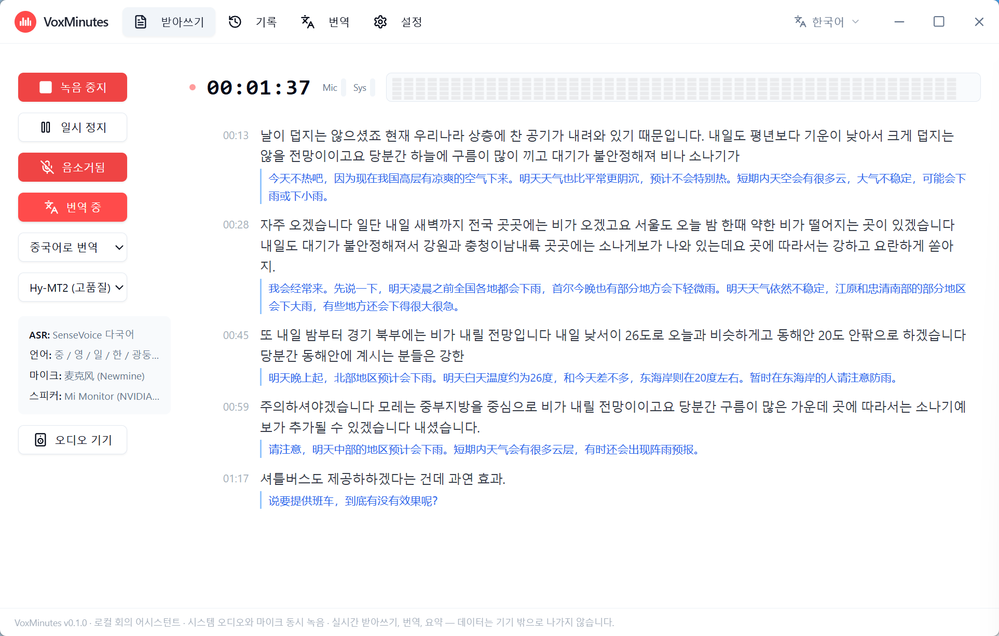

<div align="center">


# VoxMinutes

**로컬 회의 어시스턴트 · 완전 물 료 · 시스템 오디오와 마이크 동시 녹음 · 실시간 받아쓰기, 13개 언어 번역, 요약 — 데이터는 기기 밖으로 나가지 않습니다**

**[English](README.md) | [中文](README.zh-CN.md) | 한국어 | [日本語](README.ja.md)**

[](LICENSE)
[]()
[]()
[]()
[](https://github.com/Longt-audio/voxminutes/pulls)

🎙️ **듀얼 채널 녹음** · 📝 **실시간 받아쓰기** · 🌐 **13개 언어 번역** · 🤖 **로컬 AI 요약**

### [⬇️ Windows용 다운로드](https://github.com/Longt-audio/voxminutes/releases/latest)

<sub>**묾료 · 계정 불필요 · 구독 없음 · 약 50MB** &nbsp;|&nbsp; 🍎 macOS / 🐧 Linux — [Issue에 투표](https://github.com/Longt-audio/voxminutes/issues)하여 우선순위 결정에 참여하세요</sub>



*👆 애니메이션 데모: 듀얼 채널 녹음, 실시간 받아쓰기, 실시간 번역, AI 회의록. 음성 포함 전체 데모를 보고 싶다면 [60초 영상](docs/promotion-v2/videos/voxminutes-v2-horizontal.mp4) 또는 [30초 하이라이트 버전](docs/promotion-v2/videos/voxminutes-v2-horizontal-short.mp4)을 확인하세요.*

</div>

---

> ## 🚀 이번 주 새 버전 출시 · New Version This Week
>
> **이미 다운로드하셨나요? 업데이트하러 오세요!** v0.2.0 세 가지 주요 기능:
>
> - 🪙 **크레딧 시스템** — 내장 크레딧으로 원격 클라우드 모델 사용 (더 큰 모델, 더 빠른 속도)
> - 💬 **데스크톱 자막** — 실시간 전사가 데스크톱 자막으로 표시, 자막 있는 영상처럼 회의 보기
> - 🔊 **번역 TTS** — 번역 결과 음성 읽기 지원: 전사 → 번역 → 듣기
>
> 👉 **[최신 버전 받기](https://github.com/Longt-audio/voxminutes/releases/latest)** · 이번 주 출시

---

---

## 빠른 링크

[주요 기능](#주요-기능) · [왜 VoxMinutes인가](#왜-voxminutes인가) · [모델 지원](#모델-지원) · [다운로드 및 설치](#다운로드-및-설치) · [소스에서 빌드](#소스에서-빌드) · [기술 스택](#기술-스택) · [로드맵](#로드맵) · [개인정보 보호](#개인정보-보호) · [기여](#기여)

---

## 소개

VoxMinutes는 **완전 묾료, 로컬 우선** 데스크톱 앱(Windows, Tauri 2)으로, 회의를 실시간으로 받아쓰면서 **시스템 재생 음성과 마이크 입력을 동시에** 녹음합니다 — 많은 유사 도구는 마이크만 지원합니다. 받아쓴 내용은 13개 언어로 실시간 번역할 수 있고, AI 회의록도 한 번에 생성할 수 있으며, 모든 모델이 사용자의 컴퓨터에서 직접 실행됩니다. **오디오와 텍스트는 절대 기기를 떠나지 않으며, 모든 기능은 완전 묾료입니다 — 구독도, 유료 장벽(페이월)도 없습니다.**

첫 실행 시 내장된 시작 가이드가 필요한 모델을 다운로드하거나 가져오는 과정을 안내합니다(GitHub / HuggingFace 미러 / ModelScope 다중 소스 다운로드, 로컬 압축 파일 / GGUF 파일 가져오기 지원).

## 왜 VoxMinutes인가

| 불편한 점 | 일반적인 도구 | VoxMinutes |
|-----------|--------------|------------|
| 비용 | Otter.ai, 讯飞听见: 분당 과금 | **완전 묾료, 구독도 페이월도 없음** |
| 개인정보 | 오디오가 클라우드에 업로드됨 | **모든 것이 내 기기에서 실행** |
| 녹음 | 마이크만 또는 시스템 사운드만 | **시스템 사운드 + 마이크 동시 녹음** |
| 사용 난이도 | Whisper 계열 도구는 CLI/설정 필요 | **앱 내 모델 관리자, 터미널 불필요** |
| 호환성 | 브라우저 플러그인은 오디오 권한 제한 | **시스템 레벨 캡처, 모든 회의 앱과 호환** |

> VoxMinutes는 Zoom, Teams, Google Meet, 腾讯会议, 飞书, 웨비나, 온라인 강의, 인터뷰 등에서 사용할 수 있습니다 — 특정 앱에 의존하지 않고 시스템 레벨에서 오디오를 캡처하기 때문입니다.

## 빠른 시작

1. 최신 Windows 설치 패키지(약 50MB)를 [Releases](https://github.com/Longt-audio/voxminutes/releases)에서 다운로드합니다.
2. **설치 후 실행** — 시작 가이드가 ASR 모델(필수)과 선택적인 번역/요약 모델 다운로드를 안내합니다. 중국 본토에서는 프록시 불필요: 다운로드 소스가 자동으로 hf-mirror / gh-proxy / ModelScope로 폴 백됩니다.
3. **녹음 시작** — 회의를 시작하고, 텍스트가 실시간으로 나타나는 것을 보고, 라이브 번역을 사용하고, 끝나면 "Meeting Summary"를 클릭합니다.

> ⚠️ **Windows 참고:** 설치 패키지는 아직 코드 서명이 되어 있지 않아 SmartScreen 파란 경고가 표시될 수 있습니다 — **추가 정보 → 계속 실행**을 클릭하세요. 소스가 공개되어 있으니 안심하세요.

## 주요 기능

- **실시간 스트리밍 받아쓰기**: 두 가지 로컬 ASR 엔진 선택 가능
  - `X-ASR` — 중-영 완전 스트리밍, 480ms 청크, 낮은 지연
  - `SenseVoice` — 다국어(중/영/일/한/광둥어), VAD 유사 스트리밍
- **듀얼 채널 녹음**: 시스템 재생 + 마이크 동시 녹음, 자동 믹싱
- **실시간 번역**: 문장 단위 파이프라인, 번역문이 토큰 단위로 스트리밍 표시
  - `OPUS-MT` — 가볍고 빠름, 중-영 번역
  - `Hy-MT2`(텐센트 Hunyuan) — 더 높은 품질, **13개 대상 언어**
- **AI 회의록**: 로컬 GGUF LLM(Qwen / Gemma)으로 오프라인 요약, 원격 API 또는 웹 AI도 사용 가능; 결과는 별도 패널에 표시, Markdown으로 낼볼내기
- **번역 페이지**: 텍스트 입력 즉시 번역, 원본 언어 자동 인식
- **기록**: SQLite 저장, 검색 및 제목/문장 인라인 편집
- **파일 받아쓰기**: 오디오 파일 가져오기, 다른 엔진으로 재인식
- **낼볼내기**: TXT / SRT / Markdown / 회의록 Markdown
- **모델 관리자**: 앱 내 다운로드(다중 소스, 이어 받기, 병렬) 또는 로컬 가져오기, 명령줄 불필요
- **다국어 UI**: English / 中文 / 한국어 / 日本語, 시작 화면에서 전환 가능

## 모델 지원

모든 모델은 **앱 내에서 다운로드하거나 사용자가 직접 가져오는 방식**이며, 설치 패키지에는 모델이 포함되어 있지 않습니다. 다운로드 소스는 순서대로 자동 폴 백(공식 → 미러)되어 중국 본토 네트워크에서도 바로 사용할 수 있습니다.

| 모델 | 용도 | 크기 | 다운로드 소스 |
|------|------|------|----------------|
| SenseVoice (sherpa-onnx) | ASR: 중/영/일/한/광둥어 | ~854 MB | GitHub Releases / gh-proxy |
| X-ASR 480ms (sherpa-onnx) | ASR: 중-영 스트리밍 | ~557 MB | GitHub Releases / gh-proxy |
| OPUS-MT 중→영 / 영→중 | 번역(빠름) | 각 ~113 MB | HuggingFace / hf-mirror / ModelScope |
| Hy-MT2-1.8B (텐센트 Hunyuan) | 번역(고품질, 13개 언어) | ~1.1 GB | HuggingFace / hf-mirror |
| Qwen2.5-3B-Instruct | 회의록(작고 빠름) | ~2.1 GB | HuggingFace / hf-mirror / ModelScope |
| Qwen3-4B-Instruct-2507 | 회의록(더 나은 품질) | ~2.5 GB | HuggingFace / hf-mirror |
| Gemma-3-4B-it | 회의록(영어에 강함) | ~2.5 GB | HuggingFace / hf-mirror |

참고:

- 모든 모델은 Q4/int8 양자화되어 **CPU만으로 실행**됩니다(8 스레드 머신에서 Hy-MT2는 문장당 약 2~4초); ASR 실시간 계수(RTF) ≈ 0.25
- 모델 파일은 앱의 모델 디렉터리에 저장되며, 설정에서 확인·삭제·가져오기(`.tar.bz2` / `.tar.gz` / `.zip` 압축 파일 또는 `.gguf` 파일)를 할 수 있습니다
- 위 목록에 등록된 모델만 지원하며, 사용자 정의 모델은 아직 지원하지 않습니다

### 수동 다운로드

앱 내 다운로드가 느릴 때는 링크를 다운로드 매니저(IDM, aria2 등)에 붙여넣고, 완료 후 **설정 → 모델 → 가져오기**로 설치하세요(`.tar.bz2` / `.tar.gz` / `.zip` 압축 파일, `.gguf` 파일, 준비된 모델 폴터 지원):

- **SenseVoice** (.tar.bz2): [GitHub](https://github.com/k2-fsa/sherpa-onnx/releases/download/asr-models/sherpa-onnx-sense-voice-zh-en-ja-ko-yue-2024-07-17.tar.bz2) / [gh-proxy 미러](https://gh-proxy.com/https://github.com/k2-fsa/sherpa-onnx/releases/download/asr-models/sherpa-onnx-sense-voice-zh-en-ja-ko-yue-2024-07-17.tar.bz2)
- **X-ASR 480ms** (.tar.bz2): [GitHub](https://github.com/k2-fsa/sherpa-onnx/releases/download/asr-models/sherpa-onnx-x-asr-480ms-streaming-zipformer-transducer-zh-en-punct-2026-06-05.tar.bz2) / [gh-proxy 미러](https://gh-proxy.com/https://github.com/k2-fsa/sherpa-onnx/releases/download/asr-models/sherpa-onnx-x-asr-480ms-streaming-zipformer-transducer-zh-en-punct-2026-06-05.tar.bz2)
- **OPUS-MT 중→영** (`encoder_model_int8.onnx`, `decoder_model_merged_int8.onnx`, `tokenizer.json` 필요): [HuggingFace](https://huggingface.co/Xenova/opus-mt-zh-en) / [ModelScope](https://modelscope.cn/models/Xenova/opus-mt-zh-en); **영→중**: [HuggingFace](https://huggingface.co/Xenova/opus-mt-en-zh) / [ModelScope](https://modelscope.cn/models/Xenova/opus-mt-en-zh)
- **Hy-MT2-1.8B** (.gguf): [HuggingFace](https://huggingface.co/tencent/Hy-MT2-1.8B-GGUF/resolve/main/Hy-MT2-1.8B-Q4_K_M.gguf) / [hf-mirror](https://hf-mirror.com/tencent/Hy-MT2-1.8B-GGUF/resolve/main/Hy-MT2-1.8B-Q4_K_M.gguf)
- **Qwen2.5-3B-Instruct** (.gguf): [HuggingFace](https://huggingface.co/Qwen/Qwen2.5-3B-Instruct-GGUF/resolve/main/qwen2.5-3b-instruct-q4_k_m.gguf) / [hf-mirror](https://hf-mirror.com/Qwen/Qwen2.5-3B-Instruct-GGUF/resolve/main/qwen2.5-3b-instruct-q4_k_m.gguf) / [ModelScope](https://modelscope.cn/models/Qwen/Qwen2.5-3B-Instruct-GGUF/resolve/master/qwen2.5-3b-instruct-q4_k_m.gguf)
- **Qwen3-4B-Instruct-2507** (.gguf): [HuggingFace](https://huggingface.co/bartowski/Qwen_Qwen3-4B-Instruct-2507-GGUF/resolve/main/Qwen_Qwen3-4B-Instruct-2507-Q4_K_M.gguf) / [hf-mirror](https://hf-mirror.com/bartowski/Qwen_Qwen3-4B-Instruct-2507-GGUF/resolve/main/Qwen_Qwen3-4B-Instruct-2507-Q4_K_M.gguf)
- **Gemma-3-4B-it** (.gguf): [HuggingFace](https://huggingface.co/bartowski/google_gemma-3-4b-it-GGUF/resolve/main/google_gemma-3-4b-it-Q4_K_M.gguf) / [hf-mirror](https://hf-mirror.com/bartowski/google_gemma-3-4b-it-GGUF/resolve/main/google_gemma-3-4b-it-Q4_K_M.gguf)

## 화면 구성

- **받아쓰기**: 녹음 컨트롤 + 실시간 텍스트 + 인라인 번역(위 데모 참고)
- **기록**: 목록 / 검색 / 상세 편집 / 낼볼내기 / AI 회의록
- **번역**: 입력 즉시 번역, 13개 대상 언어
- **설정**: 모델(다운로드/가져오기/삭제), 오디오 및 낼볼내기, API, 고급

## 다운로드 및 설치

1. [Releases](../../releases)에서 최신 Windows 설치 패키지(또는 포터블 패키지)를 다운로드합니다
2. 설치 후 실행하면 **시작 가이드**가 자동으로 나타나 ASR 모델(필수)과 번역·회의록 모델(선택)을 다운로드하거나 가져오도록 안내합니다
3. 모델은 이후에도 **설정 → 모델**에서 언제든지 다운로드 / 가져오기 / 삭제할 수 있습니다

> 팁: 중국 본토에서는 프록시 없이도 다운로드 소스가 자동으로 미러(hf-mirror / gh-proxy / ModelScope)로 폴 백됩니다.

## 소스에서 빌드

요구 사항: Windows 10/11 x64, Git, Node.js LTS, pnpm, Rust 1.77+, CMake, VS2022 Build Tools(macOS / Linux 지원 예정).

```bash
git clone https://github.com/Longt-audio/voxminutes.git
cd voxminutes/frontend
pnpm install --ignore-workspace
pnpm build
pnpm tauri:dev
```

로컬 LLM 기능(Hy-MT2 번역 / 로컬 회의록)을 사용하려면 llama-helper 사이드칙도 빌드해야 합니다(libclang 필요):

```powershell
$env:LIBCLANG_PATH = "<리포지터리 루트>\.tooling\llvm\bin"
cargo build -p llama-helper --release
copy target\release\llama-helper.exe frontend\src-tauri\binaries\llama-helper-x86_64-pc-windows-msvc.exe
```

더 많은 개발 명령은 [docs/DEV_COMMANDS.md](docs/DEV_COMMANDS.md)를 참고하세요.

## 기술 스택

| 계층 | 기술 |
|------|------|
| 데스크톱 | Tauri 2 + Next.js(정적 낼볼내기) + React + Tailwind CSS |
| 시스템 | Rust |
| ASR | sherpa-onnx(SenseVoice / X-ASR, ONNX Runtime) |
| 번역 | OPUS-MT(ONNX Runtime) / Hy-MT2(llama.cpp 사이드카) |
| 회의록 | llama.cpp 사이드카(GGUF, Qwen / Gemma) + OpenAI 호환 원격 API |
| 데이터베이스 | SQLite |

## 로드맵

| 버전 | 목표 |
|------|------|
| v0.1.0 (현재 MVP) | 실시간/파일 받아쓰기, 듀얼 엔진 번역, 로컬 회의록, 기록 및 낼볼내기, 모델 다운로드/가져오기, 시작 가이드 |
| v0.2.0 | TTS, 자막 플로팅 창, 드래그 번역 |
| v0.3.0 | 푸시투토크 실시간 통역, 실시간 요약, 화자 분리 |
| 향후 (유료) | 클라우드 고정밀 ASR, 팀 워크스페이스 |

> 💡 macOS / Linux, TTS, 화자 분리를 더 빨리 원하시나요? Issue를 올리거나 기존 Issue에 투표하세요 — 로드맵 우선순위는 커뮤니티 수요를 따릅니다.

## 개인정보 보호

녹음, 받아쓰기, 번역, 요약은 모두 사용자의 기기에서 처리됩니다. 원격 회의록 API를 직접 설정하지 않는 한, 앱은 어떤 서버와도 콘텐츠를 주고받지 않습니다.

## 라이선스

이 프로젝트는 **AGPL-3.0** 라이선스를 따릅니다. 자세한 내용은 [LICENSE](LICENSE)를 참고하세요.

## 기여

Issue와 Pull Request를 환영합니다. 제출 전에 `cargo check --workspace`, `cargo test`, `cd frontend && pnpm build`가 통과하는지 확인해 주세요.

- 🐛 버그 신고 & 기능 요청: [Issues](https://github.com/Longt-audio/voxminutes/issues)
- 💬 질문 & 아이디어 공유: [Discussions](https://github.com/Longt-audio/voxminutes/discussions)
- ⭐ VoxMinutes가 도움이 되셨다면 **스타를 눌러주세요** — 더 많은 사람들이 발견할 수 있게 도와줍니다!

---

**VoxMinutes** — 당신의 목소리, 당신의 데이터.
