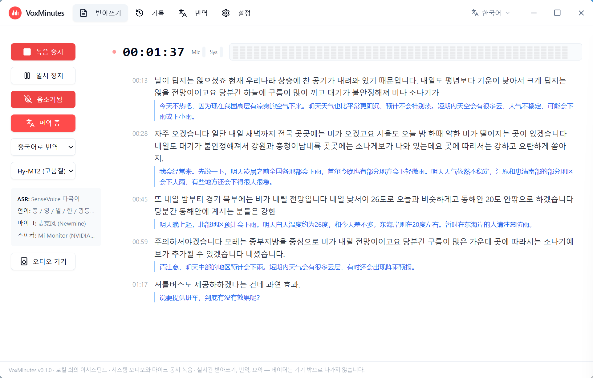

<div align="center">


# VoxMinutes

**로컬 회의 어시스턴트 · 핵심 기능 영구 무료 · 클라우드 모델 선택 지원 · 시스템 오디오와 마이크 동시 녹음 · 실시간 받아쓰기, 13개 언어 번역, 데스크톱 자막, AI 회의록 — 로컬 모드에서는 데이터가 기기 밖으로 나가지 않습니다**

<sub>您的本地会议助手 · 核心功能永久免费 · 系统声音与麦克风同步录制 · 实时转写、13 种语言翻译、桌面悬浮字幕与 AI 会议纪要，数据不出设备</sub>

<sub>Your local meeting assistant · Core features free forever · Optional cloud models · Records system audio & mic together · Live transcription, translation into 13 languages, floating desktop subtitles & AI meeting notes — your data stays on-device in local mode</sub>

<sub>ローカル会議アシスタント · コア機能は永久無料 · クラウドモデルにも対応（任意）· システム音声とマイクを同時録音 · リアルタイム文字起こし・13言語翻訳・デスクトップ字幕・AI議事録。ローカルモードならデータはデバイスの外に出ません</sub>

**공식 사이트(다운로드 / 가격 / 자주 묻는 질문): [voxmin.top](https://voxmin.top/ko/)**

**[English](README.en.md) | [中文](README.md) | 한국어 | [日本語](README.ja.md)**

[](LICENSE)
[]()
[]()
[]()
[](https://github.com/Longt-audio/voxminutes/pulls)

🎙️ **2채널 녹음** · 📝 **실시간 받아쓰기** · 🌐 **13개 언어 번역** · 💬 **데스크톱 자막** · 🤖 **AI 회의록**

### [⬇️ 공식 사이트에서 다운로드(권장 · 중국 본토에서는 직결이 더 빠름)](https://voxmin.top/ko/#download)

[GitHub Releases(백업 소스)](https://github.com/Longt-audio/voxminutes/releases/latest) · [macOS 버전(출시 예정)](#macos-버전-출시-예정) · [소스 보기](https://github.com/Longt-audio/voxminutes)

<sub>**무료 · 로컬 사용은 계정 불필요 · 약 50 MB · AGPL-3.0 오픈소스** &nbsp;|&nbsp; 🪟 Windows 10 / 11(정식 지원) · 🍎 macOS 출시 예정 · 🐧 Linux 계획 중 — [Issue에 투표](https://github.com/Longt-audio/voxminutes/issues)하여 우선순위를 정하는 데 도움을 주세요</sub>



*👆 애니메이션 데모: 2채널 녹음, 실시간 받아쓰기, 실시간 번역, AI 회의록. 음성이 포함된 전체 데모를 보고 싶다면 [60초 영상](docs/promotion-v2/videos/voxminutes-v2-horizontal.mp4) 또는 [30초 하이라이트 버전](docs/promotion-v2/videos/voxminutes-v2-horizontal-short.mp4)을 확인하세요.*

</div>

---

> ## 🚀 v0.2.0 출시 · Now Available
>
> 이번 버전에서 세 가지가 달라졌습니다: **클라우드 우수 모델을 앱에 연결하고, 자막을 데스크톱 위로 띄우고, 무료와 유료를 확실히 나눴습니다.**
>
> - 🪙 **클라우드 우수 모델** — 몇 GB짜리 모델 다운로드를 기다릴 필요 없이 클라우드 대형 모델(豆包 / 千问 / MiMo / Deepgram, 30개 이상 언어)을 바로 호출합니다. 같은 회의를 다른 모델로 다시 인식해 비교할 수도 있습니다
> - 💬 **데스크톱 자막** — 항상 최상단에 표시되는 독립 자막 창, 드래그로 옮기고 줄 수와 글자 크기를 조절할 수 있어 외국어 회의가 자막 있는 영상처럼 편해집니다
> - 💰 **로컬은 무료 · 클라우드는 선택** — 로컬 모델은 영구 무료이며 시간·횟수 제한이 없고, 직접 클라우드 모델을 선택했을 때만 실제 사용량만큼 크레딧이 차감됩니다. **구독도, 월정액도, 자동 갱신도 없습니다**
>
> 👉 **[공식 사이트 다운로드](https://voxmin.top/ko/#download)** · **[GitHub Releases](https://github.com/Longt-audio/voxminutes/releases/latest)** · **[새 버전 하이라이트](https://voxmin.top/ko/#whatsnew)**

---

## 빠른 링크

[이것은 무엇인가](#이것은-무엇인가) · [VoxMinutes를 선택하는 이유](#voxminutes를-선택하는-이유) · [다운로드 및 설치](#다운로드-및-설치) · [로컬인가 클라우드인가](#로컬인가-클라우드인가) · [기능](#기능) · [모델 지원](#모델-지원) · [크레딧 충전](#크레딧-충전선택) · [소스에서 빌드](#소스에서-빌드) · [로드맵](#로드맵) · [개인정보 보호](#개인정보-보호) · [자주 묻는 질문](#자주-묻는-질문) · [기여](#기여)

> 🌐 공식 사이트 **[voxmin.top](https://voxmin.top/ko/)** 에 더 자세한 소개, 가격, 자주 묻는 질문이 있습니다(4개 언어).

---

## 이것은 무엇인가

VoxMinutes는 **로컬 우선** 데스크톱 회의 어시스턴트(Windows, Tauri 2)입니다. 회의 중에 실시간으로 받아쓰면서 시스템에서 재생되는 소리와 마이크 입력, **두 가지 오디오를 동시에 녹음**합니다 — 비슷한 도구 중에는 마이크만 지원하는 경우가 많습니다.

받아쓴 결과는 13개 언어로 실시간 번역하고, 데스크톱 자막으로 띄우고, 클릭 한 번으로 AI 회의록을 만들 수 있습니다. **핵심 기능은 모두 당신의 컴퓨터에서 실행됩니다 — 로컬은 영구 무료·오픈소스이며, 더 강력한 결과가 필요할 때 클라우드 우수 모델을 골라 쓸 수 있습니다.**

첫 실행 시 내장된 시작 가이드가 필요한 모델 다운로드 또는 가져오기를 안내합니다(GitHub, HuggingFace 미러, ModelScope 다중 소스 다운로드, 로컬 압축 파일 / GGUF 파일 가져오기 지원). 클라우드 모델을 바로 선택해 다운로드를 건너뛸 수도 있습니다.

|  |  |
|---|---|
| **13개** 실시간 번역 언어 | **2채널** 시스템 오디오 + 마이크 동시 녹음 |
| **100%** 핵심 기능 영구 무료 | **0 바이트** 로컬 모드 업로드 없음 |

## VoxMinutes를 선택하는 이유

| 불편한 점 | 일반적인 도구 | VoxMinutes |
|------|----------|------------|
| 비용 | Otter.ai, 讯飞听见(Xunfei Tingjian): 분당 과금 | **로컬 기능은 영구 무료**, 시간·횟수 무제한; 클라우드는 선택적 사용량 과금 |
| 개인정보 | 오디오를 클라우드에 업로드 | **로컬 모드에서는 모든 것이 내 기기에서 실행**, 0 바이트 업로드 |
| 녹음 | 마이크만, 또는 시스템 오디오만 녹음 가능 | **시스템 오디오 + 마이크 동시 녹음**, 자동 믹싱 |
| 받아쓰기 | 클라우드 인식만 지원, 오프라인에서는 사용 불가 | **로컬 두 엔진 스트리밍 인식, 완전 오프라인 가능**; 더 강력한 성능이 필요하면 클라우드로 전환 |
| 번역 | 별도의 번역 앱을 따로 열어야 함 | **13개 언어 문장 단위 실시간 번역** + 데스크톱 자막 |
| 사용 난이도 | Whisper 계열 도구는 명령줄 / 환경 설정 필요 | **앱 내 모델 관리자 + 시작 가이드**, 터미널 불필요 |
| 호환성 | 브라우저 확장 프로그램은 오디오 권한 제한 | **시스템 수준 캡처, 모든 회의 앱과 호환** |

> 특정 앱에 의존하지 않고 **시스템 수준**에서 오디오를 수집하므로 Zoom, Tencent Meeting, Feishu, Teams, Google Meet, 온라인 강의, 라이브 방송, 인터뷰를 모두 녹음할 수 있고, 노트북을 회의실에 가져가 대면 토론을 녹음할 수도 있습니다.

## 다운로드 및 설치

| 플랫폼 | 상태 | 다운로드 |
|---|---|---|
| 🪟 **Windows 10 / 11** | ✅ **정식 지원** | **① 공식 사이트(권장, 중국 본토에서는 직결이 더 빠름)**: [voxmin.top/ko/#download](https://voxmin.top/ko/#download)<br>**② GitHub Releases(백업 소스)**: [releases/latest](https://github.com/Longt-audio/voxminutes/releases/latest) |
| 🍎 **macOS(Apple 실리콘)** | 🔜 **출시 예정** | 개발 중이라 아직 다운로드할 수 없습니다. 먼저 [이 저장소에 Star / Watch](https://github.com/Longt-audio/voxminutes)를 누르거나 [Issues](https://github.com/Longt-audio/voxminutes/issues)에서 투표해 주세요. 출시되면 Releases와 공식 사이트에서 가장 먼저 알려 드립니다 |
| 🐧 **Linux** | 📋 계획 중 | [Issues](https://github.com/Longt-audio/voxminutes/issues)에서 투표해 주시면 우선순위 결정에 도움이 됩니다 |

<a id="macos-버전-출시-예정"></a>

> **macOS 버전 안내**: 현재 **Windows 버전만 다운로드할 수 있으며**, macOS 버전은 아직 개발 중이고 **설치 파일이 없습니다**.
> 공식 사이트와 Releases에서 macOS라고 표시된 항목은 정식 출시 전까지 사용 가능한 다운로드로 보아서는 안 됩니다. 출시 후에는 이 README, [공식 사이트](https://voxmin.top/ko/)와 [Releases](https://github.com/Longt-audio/voxminutes/releases)를 함께 업데이트하겠습니다.

**설치 및 첫 사용:**

1. **공식 사이트**에서 Windows 설치 파일(약 50 MB)을 다운로드해 더블 클릭으로 설치합니다. [Releases](https://github.com/Longt-audio/voxminutes/releases)에서 받아도 됩니다
2. 실행하면 **시작 가이드**가 자동으로 나타나 ASR 모델(필수), 번역·요약 모델(선택)을 다운로드하거나 가져오도록 안내합니다. 클라우드 모델을 선택하면 다운로드를 건너뛸 수 있습니다
3. 마이크와 시스템 오디오를 선택하고 녹음을 누르면 글이 실시간으로 나타납니다. 번역과 데스크톱 자막은 언제든 켤 수 있습니다
4. 끝나면 클릭 한 번으로 AI 회의록을 생성합니다. 기록에서 전체 검색, 편집, 재인식이 가능하고 TXT / SRT / Markdown / PDF로 내보낼 수 있습니다

> ⚠️ **보안 안내**: 설치 파일에 아직 코드 서명 인증서가 없어 시스템이 한 번 막을 수 있습니다. 소프트웨어에 문제가 있다는 뜻은 아닙니다(소스가 완전히 공개되어 있고, 아래 설명대로 직접 빌드할 수도 있습니다).
> **Windows**: SmartScreen 파란 경고가 뜨면 '추가 정보 → 실행'을 누르세요.
> **macOS**(버전 출시 후): "개발자를 확인할 수 없습니다"가 뜨면 앱을 우클릭해 '열기'를 선택하거나, '시스템 설정 → 개인정보 보호 및 보안'에서 '그래도 열기'를 누르세요.

## 로컬인가 클라우드인가

같은 앱, 두 가지 엔진. 일상 회의는 로컬로, 정확도나 다국어가 필요하면 클라우드로 — 언제든 바꿀 수 있습니다.

| 항목 | 로컬 모델 | 클라우드 모델 |
|---|---|---|
| **비용** | **영구 무료**, 시간·횟수 무제한 | 실제 사용량만큼 크레딧 차감 |
| **네트워크** | 모델 다운로드 후 **완전 오프라인** | 인터넷 필요, 대부분 지역에서 직결 가능 |
| **개인정보** | 오디오와 텍스트가 **전 과정에서 컴퓨터를 떠나지 않음** | 직접 선택한 부분만 서버로 전송 |
| **준비 비용** | 최초 0.5 ~ 2.5 GB 모델 다운로드 필요 | 다운로드 없이 선택 즉시 사용 |
| **적합한 용도** | 일상 회의, 보안이 중요한 업무, 오프라인 환경 | 다국어 회의, 장시간 회의, 높은 인식 정확도 |

## 기능

- **2채널 녹음**: 시스템 오디오와 마이크를 동시에 수집하고 자동으로 믹싱합니다. 온라인 회의, 온라인 강의, 인터뷰, 대면 토론까지 어느 쪽 말도 놓치지 않습니다.
- **실시간 스트리밍 받아쓰기**: 두 가지 로컬 ASR 엔진 중 선택, 말하는 동시에 글이 나옵니다
  - `X-ASR`(중·영 이중 언어 완전 스트리밍, 480ms 청크, 낮은 지연)
  - `SenseVoice`(중/영/일/한/광둥어 다국어, VAD 유사 스트리밍)
- **실시간 번역**: 문장 단위 파이프라인, 번역문이 글자 단위로 스트리밍 표시, 13개 대상 언어
  - `OPUS-MT`: 가볍고 빠름, 중·영 상호 번역
  - `Hy-MT2`(텐센트 Hunyuan): 더 높은 품질, 13개 대상 언어
- **데스크톱 자막**: 항상 최상단에 표시되는 독립 자막 창, 드래그 가능, 줄 수와 글자 크기 조절(최근 50개 문단 되돌아보기), 외국어 회의가 자막 있는 영상처럼 편해집니다
- **음성 읽기(보조 기능)**: **이미 만들어진** 원문과 번역문을 읽어 줍니다. **31개 언어** 지원, 음색(목소리) 선택 가능(전용 페이지에서 미리 듣기·오디오 저장) — **실시간 받아쓰기에는 관여하지 않습니다**
- **AI 회의록**: 로컬 GGUF 대형 모델(Qwen / Gemma)로 주제, 결론, 할 일을 오프라인 생성. 직접 준비한 API나 웹 AI를 연결할 수도 있습니다
- **기록과 검색**: 로컬 SQLite 저장, 전체 검색, 제목/문단 인라인 편집, 다른 모델로 재인식
- **파일 받아쓰기**: 오디오 파일을 가져와 오프라인 받아쓰기, 재인식, 여러 녹음 병합
- **화자 구분과 이름 변경**: 오프라인 인식(파일 받아쓰기 / 재인식)에서 클라우드 Doubao / Qwen 모델을 사용하면 서로 다른 화자를 자동으로 구분해 「누가 말하는지」별로 문단을 표시합니다. 기록 상세 페이지에서 화자 이름을 클릭하면 원하는 이름(예: 「김 부장」「고객」)으로 바꿀 수 있어, 회의록에서 누가 어떤 의견을 냈는지 한눈에 알 수 있습니다
- **다양한 형식으로 내보내기**: TXT / SRT / Markdown / 회의록, PDF로 바로 인쇄해 보관
- **모델 관리자**: 앱 내 다운로드(다중 소스 + 이어 받기 + 여러 모델 병렬) 또는 로컬 가져오기, 명령줄 불필요
- **다국어 인터페이스**: English / 中文 / 한국어 / 日本語, 시작 화면에서 바로 전환

## 모델 지원

### 로컬 모델(무료 · 오프라인)

모든 로컬 모델은 **앱 내 다운로드 또는 사용자 직접 가져오기** 방식이며, 설치 패키지에 어떤 모델도 포함되어 있지 않습니다. 다운로드 소스는 순서대로 자동 폴백(공식 소스 → 국내 미러)되어 중국 본토 네트워크에서도 바로 사용할 수 있습니다.

| 모델 | 용도 | 크기 | 다운로드 소스 |
|------|------|------|--------|
| SenseVoice (sherpa-onnx) | ASR: 중/영/일/한/광둥어 | ~854 MB | GitHub Releases / gh-proxy |
| X-ASR 480ms (sherpa-onnx) | ASR: 중·영 완전 스트리밍 | ~557 MB | GitHub Releases / gh-proxy |
| OPUS-MT 중→영 / 영→중 | 번역(빠름) | 각 ~113 MB | HuggingFace / hf-mirror / ModelScope |
| Hy-MT2-1.8B (텐센트 Hunyuan) | 번역(고품질, 13개 대상 언어) | ~1.1 GB | HuggingFace / hf-mirror |
| Qwen2.5-3B-Instruct | 회의 요약(작고 빠름) | ~2.1 GB | HuggingFace / hf-mirror / ModelScope |
| Qwen3-4B-Instruct-2507 | 회의 요약(더 나은 품질) | ~2.5 GB | HuggingFace / hf-mirror |
| Gemma-3-4B-it | 회의 요약(영어에 강함) | ~2.5 GB | HuggingFace / hf-mirror |

설명:

- 모든 모델은 Q4/int8 양자화이며 **CPU만으로 실행**됩니다. 그래픽카드가 필요 없고 8스레드 이상을 권장합니다. Hy-MT2 실시간 번역은 문장당 약 2~4초, ASR 실시간 받아쓰기 RTF ≈ 0.25
- 모델 파일은 앱의 모델 디렉터리에 저장되며, 설정 페이지에서 확인, 삭제, 가져오기할 수 있습니다(`.tar.bz2` / `.tar.gz` / `.zip` 압축 파일 또는 `.gguf` 파일)
- 위 표에 등록된 모델만 지원하며, 사용자 정의 모델은 아직 지원하지 않습니다

### 클라우드 모델(선택 · 크레딧 과금)

모델을 다운로드할 필요 없이 선택 즉시 사용할 수 있으며, 중·영·일·한 등 **30개 이상 언어**를 지원합니다:

| 모델 | 적합한 용도 |
|---|---|
| Doubao(豆包) | 중국어 회의, 화자 구분 |
| Qwen(千问) | 여러 언어가 섞인 회의, 화자 구분 |
| MiMo | 가성비 좋은 일상 환경 |
| Deepgram | 영어 전용 / 해외 환경 |

같은 회의를 다른 모델로 다시 인식해 결과를 바로 비교할 수 있습니다 — 더 정확한 모델을 쓰면 됩니다.

### 수동 다운로드

앱 내 다운로드가 느릴 때는 링크를 다운로드 프로그램(迅雷 / IDM / aria2)에 복사해 받은 뒤 '설정 → 모델'에서 '가져오기'를 눌러 설치하세요(`.tar.bz2` / `.tar.gz` / `.zip` 압축 파일, `.gguf` 파일, 파일이 모두 준비된 모델 폴더 지원):

- **SenseVoice** (.tar.bz2): [GitHub](https://github.com/k2-fsa/sherpa-onnx/releases/download/asr-models/sherpa-onnx-sense-voice-zh-en-ja-ko-yue-2024-07-17.tar.bz2) / [gh-proxy 미러](https://gh-proxy.com/https://github.com/k2-fsa/sherpa-onnx/releases/download/asr-models/sherpa-onnx-sense-voice-zh-en-ja-ko-yue-2024-07-17.tar.bz2)
- **X-ASR 480ms** (.tar.bz2): [GitHub](https://github.com/k2-fsa/sherpa-onnx/releases/download/asr-models/sherpa-onnx-x-asr-480ms-streaming-zipformer-transducer-zh-en-punct-2026-06-05.tar.bz2) / [gh-proxy 미러](https://gh-proxy.com/https://github.com/k2-fsa/sherpa-onnx/releases/download/asr-models/sherpa-onnx-x-asr-480ms-streaming-zipformer-transducer-zh-en-punct-2026-06-05.tar.bz2)
- **OPUS-MT 중→영**(`encoder_model_int8.onnx`, `decoder_model_merged_int8.onnx`, `tokenizer.json` 세 파일 필요): [HuggingFace](https://huggingface.co/Xenova/opus-mt-zh-en) / [ModelScope](https://modelscope.cn/models/Xenova/opus-mt-zh-en); **영→중**: [HuggingFace](https://huggingface.co/Xenova/opus-mt-en-zh) / [ModelScope](https://modelscope.cn/models/Xenova/opus-mt-en-zh)
- **Hy-MT2-1.8B** (.gguf): [HuggingFace](https://huggingface.co/tencent/Hy-MT2-1.8B-GGUF/resolve/main/Hy-MT2-1.8B-Q4_K_M.gguf) / [hf-mirror 미러](https://hf-mirror.com/tencent/Hy-MT2-1.8B-GGUF/resolve/main/Hy-MT2-1.8B-Q4_K_M.gguf)
- **Qwen2.5-3B-Instruct** (.gguf): [HuggingFace](https://huggingface.co/Qwen/Qwen2.5-3B-Instruct-GGUF/resolve/main/qwen2.5-3b-instruct-q4_k_m.gguf) / [hf-mirror 미러](https://hf-mirror.com/Qwen/Qwen2.5-3B-Instruct-GGUF/resolve/main/qwen2.5-3b-instruct-q4_k_m.gguf) / [ModelScope](https://modelscope.cn/models/Qwen/Qwen2.5-3B-Instruct-GGUF/resolve/master/qwen2.5-3b-instruct-q4_k_m.gguf)
- **Qwen3-4B-Instruct-2507** (.gguf): [HuggingFace](https://huggingface.co/bartowski/Qwen_Qwen3-4B-Instruct-2507-GGUF/resolve/main/Qwen_Qwen3-4B-Instruct-2507-Q4_K_M.gguf) / [hf-mirror 미러](https://hf-mirror.com/bartowski/Qwen_Qwen3-4B-Instruct-2507-GGUF/resolve/main/Qwen_Qwen3-4B-Instruct-2507-Q4_K_M.gguf)
- **Gemma-3-4B-it** (.gguf): [HuggingFace](https://huggingface.co/bartowski/google_gemma-3-4b-it-GGUF/resolve/main/google_gemma-3-4b-it-Q4_K_M.gguf) / [hf-mirror 미러](https://hf-mirror.com/bartowski/google_gemma-3-4b-it-GGUF/resolve/main/google_gemma-3-4b-it-Q4_K_M.gguf)

## 크레딧 충전(선택)

**로컬은 영구 무료, 클라우드는 사용량 과금.** 크레딧은 클라우드 모델을 호출할 때만 차감됩니다 — 음성 인식, 실시간 번역, 회의 요약, 음성 읽기가 하나의 잔액을 함께 사용합니다.

| 크레딧 팩 | 가격 | 예상 사용 시간 | 적합한 용도 |
|---|---|---|---|
| 체험팩 | **¥10 / 200 크레딧** | 전체 회의 약 4~7시간 | 클라우드 모델을 먼저 써보고 싶다면 |
| 스탠더드(가장 인기) | **¥30 / 620 크레딧** | 전체 회의 약 11~23시간 | 장시간·다국어 회의에 유리 |
| 알뜰팩 | **¥50 / 1100 크레딧** | 전체 회의 약 20~40시간 | 크레딧당 가장 저렴 |

- 시간은 '1시간 회의 = 음성 인식 + 실시간 번역 + 회의 요약' 기준으로 추산했습니다. 실시간 스트리밍 모델은 약 **54크레딧/시간**, 더 저렴한 모델은 약 **26크레딧/시간**이므로 **26~54크레딧/시간** 범위로 안내하며, 실제 사용량은 선택한 모델에 따라 다릅니다
- **구독도, 월정액도, 자동 갱신도 없습니다.** **충전한 크레딧은 충전일로부터 1년간 유효**하며, 재충전하면 기간이 연장됩니다
- 신규 가입 시 **100 크레딧**을 무료로 드립니다(전체 회의 약 2~4시간 분량). 증정 크레딧은 수령일로부터 90일간 유효합니다
- Alipay / WeChat / PayPal을 지원합니다. 결제 후 교환 코드가 자동 발급되며, 앱 '계정 → 충전/교환'에 붙여 넣으면 바로 반영됩니다
- 잔액은 계정에 연결되어 있어 **PC를 바꾸거나 앱을 재설치해도 사라지지 않습니다**
- 👉 구매와 최신 가격은 공식 사이트를 기준으로 합니다: **[voxmin.top/ko/#pricing](https://voxmin.top/ko/#pricing)**

## 화면 미리보기

- **실시간 받아쓰기**: 녹음 컨트롤 + 실시간 텍스트 + 인라인 번역문 + 데스크톱 자막(위 데모 참고)
- **기록**: 목록 / 전체 검색 / 상세 편집 / 내보내기 / AI 회의록
- **번역**: 입력 즉시 번역, 13개 대상 언어
- **음성 읽기**: 언어와 음색(목소리) 선택, 미리 듣기, 오디오 저장
- **설정**: 모델(다운로드/가져오기/삭제), 오디오 및 내보내기, API, 고급

## 소스에서 빌드

환경: Windows 10/11 x64, Git, Node.js LTS, pnpm, Rust 1.77+, CMake, VS2022 Build Tools(macOS / Linux 지원 계획 중).

```bash
git clone https://github.com/Longt-audio/voxminutes.git
cd voxminutes/frontend
pnpm install --ignore-workspace
pnpm build
pnpm tauri:dev
```

**두 개의 사이드카는 로컬에서 직접 준비해야 합니다**(용량이 크고 플랫폼별로 다르므로 저장소에 포함하지 않습니다):

- **ffmpeg**: `cargo check` / `pnpm tauri:dev` 실행 시 `frontend/src-tauri/binaries/ffmpeg-<target-triple>[.exe]`가 필요합니다
  - Windows: `powershell -File frontend/scripts/prepare-windows-sidecars.ps1`(ffmpeg.exe 자동 다운로드 및 llama-helper.exe 빌드)
  - macOS: 로컬 `ffmpeg`를 심볼릭 링크로 연결합니다. 예:
    `ln -sf "$(which ffmpeg)" frontend/src-tauri/binaries/ffmpeg-aarch64-apple-darwin`
- **llama-helper**(로컬 LLM: Hy-MT2 번역 / 로컬 회의록, 빌드에 libclang 필요):

```powershell
$env:LIBCLANG_PATH = "<프로젝트 루트>\.tooling\llvm\bin"
cargo build -p llama-helper --release
copy target\release\llama-helper.exe frontend\src-tauri\binaries\llama-helper-x86_64-pc-windows-msvc.exe
```

더 많은 개발 명령은 [docs/DEV_COMMANDS.md](docs/DEV_COMMANDS.md)를 참고하세요.

## 기술 스택

| 계층 | 기술 |
|----|------|
| 데스크톱 프레임워크 | Tauri 2 + Next.js(정적 내보내기) + React + Tailwind CSS |
| 시스템 계층 | Rust |
| ASR | sherpa-onnx(SenseVoice / X-ASR, ONNX Runtime), 선택적 클라우드 ASR |
| 기계 번역 | OPUS-MT(ONNX Runtime) / Hy-MT2(llama.cpp 사이드카), 선택적 클라우드 번역 |
| 회의 요약 | llama.cpp 사이드카(GGUF, Qwen / Gemma) + OpenAI 호환 원격 API |
| 데이터베이스 | SQLite |

## 로드맵

| 버전 | 목표 |
|------|------|
| v0.1.0 | 실시간/오프라인 받아쓰기, 두 가지 번역 엔진, 로컬 회의 요약, 기록과 내보내기, 모델 다운로드/가져오기, 첫 실행 가이드 |
| **v0.2.0(현재)** | **클라우드 우수 모델(선택), 데스크톱 자막, 음성 읽기, 오디오 가져오기 / 녹음 병합, 크레딧 시스템과 시작 가이드 개편** |
| v0.3.0 | 드래그 선택 번역, 푸시투토크 실시간 통역, 실시간 요약, 로컬 화자 분리 |
| 향후 | macOS / Linux 버전, 팀 협업 |

> 💡 macOS / Linux나 화자 분리가 더 빨리 필요하신가요? Issue를 올리거나 기존 Issue에 투표해 주세요 — 로드맵 우선순위는 커뮤니티 수요를 따릅니다.

## 개인정보 보호

기본적으로 오디오, 받아쓰기, 번역, 요약은 **모두 당신의 기기에서 처리**되며, 로컬 모드에서는 어떤 서버로도 내용을 업로드하지 않습니다.

**직접 '클라우드' 모델을 선택한 경우**(원격 음성 인식 / 번역 / 요약 / 음성 읽기)에만 해당 오디오나 텍스트가 당사 서버를 거쳐 상위 AI 서비스 제공자에게 전달되고, 사용량 및 과금 기록이 남습니다. 언제든 로컬 모델로 되돌릴 수 있습니다.

전체 데이터 처리 설명은 **[개인정보 처리방침](https://voxmin.top/en/privacy.html)** 과 **[이용약관](https://voxmin.top/en/terms.html)** 을 참고하세요.

## 자주 묻는 질문

<details>
<summary><b>VoxMinutes는 무료인가요?</b></summary>

핵심 기능은 완전히 무료이고 오픈소스(AGPL-3.0)입니다. 로컬 받아쓰기, 번역, 회의 요약, 데스크톱 자막은 모두 시간과 횟수 제한이 없고, 로컬 사용에는 **계정 가입도 필요하지 않습니다**. **클라우드 모델**을 직접 선택했을 때만 실제 사용량만큼 크레딧이 차감되며, 구독도 월정액도 자동 갱신도 없습니다. 신규 가입 시 100 크레딧을 드려 먼저 써볼 수 있습니다.
</details>

<details>
<summary><b>인터넷이 필요한가요? 데이터가 업로드되나요?</b></summary>

로컬 모델을 쓰면 모델 다운로드가 끝난 뒤 **전 과정을 오프라인**으로 사용할 수 있습니다. 오디오, 받아쓰기, 번역, 요약이 모두 당신의 컴퓨터에서 처리되고 기기 밖으로 나가지 않습니다. 직접 클라우드 모델을 선택한 경우에만 해당 오디오나 텍스트가 서버로 전송되며, 로컬 기능에는 영향이 없습니다.
</details>

<details>
<summary><b>그래픽카드가 필요한가요? 일반 노트북에서도 돌아가나요?</b></summary>

그래픽카드는 필요하지 않습니다. 모든 모델이 양자화 버전이라 **CPU만으로 실행**되며, 8스레드 이상 환경을 권장합니다. 로컬 실시간 받아쓰기 RTF ≈ 0.25, 로컬 실시간 번역은 문장당 약 2~4초입니다.
</details>

<details>
<summary><b>어떤 운영체제를 지원하나요?</b></summary>

현재 **Windows 10 / 11을 정식 지원**합니다. **macOS(Apple 실리콘 버전)는 출시 예정**이고 Linux는 계획 중입니다 — GitHub Issues에서 투표해 주시면 우선순위에 반영합니다.
</details>

<details>
<summary><b>어떤 회의 앱을 지원하나요?</b></summary>

**시스템 수준**에서 오디오를 수집하므로 특정 앱에 의존하지 않습니다. 따라서 Zoom, Tencent Meeting, Feishu, Teams, Google Meet, 온라인 강의, 방송, 팟캐스트 모두 녹음할 수 있고, 노트북을 회의실에 가져가 대면 토론을 녹음할 수도 있습니다.
</details>

<details>
<summary><b>설치할 때 시스템이 위험하다고 경고합니다. 어떻게 해야 하나요?</b></summary>

설치 파일에 아직 코드 서명 인증서가 없어서 시스템이 한 번 막는 것입니다 — 소프트웨어에 문제가 있다는 뜻이 아닙니다. 소스는 완전히 공개되어 있고, 위 설명대로 직접 빌드할 수도 있습니다.
**Windows**: SmartScreen 파란 경고가 뜨면 '추가 정보 → 실행'을 누르세요.
</details>

<details>
<summary><b>100 크레딧이면 얼마나 쓸 수 있나요? 교환 코드는 어디에 입력하나요?</b></summary>

'1시간 회의 = 음성 인식 + 번역 + 요약' 기준으로 약 26~54크레딧(선택한 모델에 따라 다름)이므로 100 크레딧은 **전체 회의 약 2~4시간** 분량입니다. 파일 받아쓰기만 한다면 훨씬 오래 쓸 수 있습니다.

[공식 사이트](https://voxmin.top/ko/#pricing)에서 크레딧 팩을 구매하면 결제 후 페이지에 교환 코드가 자동으로 표시됩니다. 앱 → '계정 → 충전/교환'에 붙여 넣으면 바로 반영됩니다. 잔액은 계정에 연결되어 있어 PC를 바꾸거나 앱을 재설치해도 사라지지 않습니다.
</details>

> 더 많은 질문은 공식 사이트 **[자주 묻는 질문](https://voxmin.top/ko/#faq)**(4개 언어)을 참고하세요.

## 라이선스

이 프로젝트는 **AGPL-3.0** 라이선스를 따릅니다. 자세한 내용은 [LICENSE](LICENSE)를 참고하세요.

## 기여

Issue와 Pull Request를 환영합니다. 제출 전에 `cargo check --workspace`, `cargo test`, `cd frontend && pnpm build`가 통과하는지 확인해 주세요.

- 🐛 버그 신고 / 기능 요청: [Issues](https://github.com/Longt-audio/voxminutes/issues)
- 💬 질문 / 아이디어 공유: [Discussions](https://github.com/Longt-audio/voxminutes/discussions)
- ⭐ VoxMinutes가 도움이 되셨다면 **스타를 눌러 주세요** — 더 많은 사람이 발견하는 데 도움이 됩니다!

---

<div align="center">

**공식 사이트 [voxmin.top](https://voxmin.top/ko/)** · [다운로드](https://voxmin.top/ko/#download) · [가격](https://voxmin.top/ko/#pricing) · [자주 묻는 질문](https://voxmin.top/ko/#faq) · [개인정보 처리방침](https://voxmin.top/en/privacy.html) · [이용약관](https://voxmin.top/en/terms.html)

**VoxMinutes** — 당신의 목소리, 당신의 데이터.

</div>
