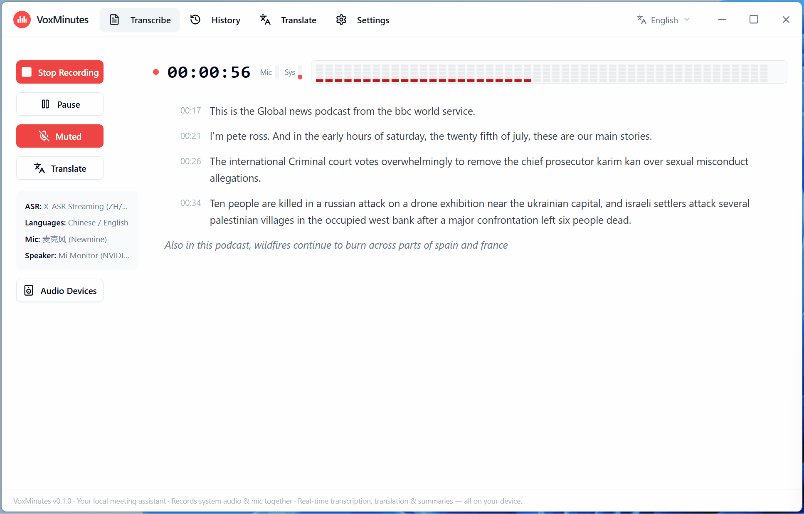

<div align="center">


# VoxMinutes

**Your local meeting assistant · Records system audio & mic together · Real-time transcription, translation & summaries — all on your device**

**English | [中文](README.zh-CN.md) | [한국어](README.ko.md) | [日本語](README.ja.md)**

[](LICENSE)
[]()
[]()



</div>

---

## What is this

VoxMinutes is a **local-first** desktop app (Windows, Tauri 2) that transcribes your meetings in real time — recording **system playback and microphone input at the same time**, something many similar tools can't do. Transcripts can be translated live into 13 languages and turned into AI meeting minutes, with every model running on your own machine. **Your audio and text never leave your device.**

On first launch, a built-in onboarding wizard walks you through downloading or importing the models you need (multi-source downloads via GitHub / HuggingFace mirrors / ModelScope, plus importing local archives or GGUF files).

## Features

- **Real-time streaming transcription** with two local ASR engines:
  - `X-ASR` — pure streaming Chinese–English, 480 ms chunks, low latency
  - `SenseVoice` — multilingual (ZH/EN/JA/KO/Cantonese), VAD pseudo-streaming
- **Dual-channel recording** — system audio + microphone captured together, auto-mixed
- **Real-time translation** — sentence-level pipeline with token-streamed output
  - `OPUS-MT` — small and fast, Chinese ⇄ English
  - `Hy-MT2` (Tencent Hunyuan) — higher quality, **13 target languages**
- **AI meeting summaries** — offline via local GGUF LLMs (Qwen / Gemma), or remote APIs / web AI; results in a dedicated panel, exportable to Markdown
- **Translate page** — paste or type any text, source language auto-detected
- **History** — SQLite-backed, with search and inline editing of titles/segments
- **File transcription** — import audio files, re-transcribe with another engine
- **Export** — TXT / SRT / Markdown / summary Markdown
- **Model manager** — in-app downloads (multi-source, resumable, parallel) or local import, no command line needed
- **Localized UI** — English / 中文 / 한국어 / 日本語, switchable from the welcome screen

## Model support

All models are **downloaded in-app or imported by the user** — the installer ships with no models. Sources fall back in order (official → mirror), so downloads work out of the box in mainland China as well.

| Model | Purpose | Size | Sources |
|-------|---------|------|---------|
| SenseVoice (sherpa-onnx) | ASR: ZH/EN/JA/KO/Cantonese | ~854 MB | GitHub Releases / gh-proxy |
| X-ASR 480ms (sherpa-onnx) | ASR: ZH/EN streaming | ~557 MB | GitHub Releases / gh-proxy |
| OPUS-MT ZH→EN / EN→ZH | Translation (fast) | ~113 MB each | HuggingFace / hf-mirror / ModelScope |
| Hy-MT2-1.8B (Tencent Hunyuan) | Translation (quality, 13 targets) | ~1.1 GB | HuggingFace / hf-mirror |
| Qwen2.5-3B-Instruct | Summaries (smaller, faster) | ~2.1 GB | HuggingFace / hf-mirror / ModelScope |
| Qwen3-4B-Instruct-2507 | Summaries (better quality) | ~2.5 GB | HuggingFace / hf-mirror |
| Gemma-3-4B-it | Summaries (stronger English) | ~2.5 GB | HuggingFace / hf-mirror |

Notes:

- All models are Q4/int8 quantized and **run on CPU alone** (Hy-MT2 translates a sentence in ~2–4 s on an 8-thread machine); ASR real-time factor ≈ 0.25
- Models live in the app's model directory; view, delete, or import them in Settings (`.tar.bz2` / `.tar.gz` / `.zip` archives or `.gguf` files)
- Only the registered models above are supported; custom models are not supported yet

## UI at a glance

- **Transcribe**: recording controls + live text + inline translations (see the demo above)
- **History**: list / search / detail editing / export / AI summary
- **Translate**: type and translate, 13 target languages
- **Settings**: models (download/import/delete), audio & export, API, advanced

## Download & install

1. Grab the latest Windows installer (or portable package) from [Releases](../../releases)
2. Install and launch — the **onboarding wizard** appears automatically and guides you through downloading or importing an ASR model (required), plus translation and summary models (optional)
3. Models can also be managed anytime under **Settings → Models**

> Tip: no proxy is needed in mainland China — download sources automatically fall back to reachable mirrors (hf-mirror / gh-proxy / ModelScope).

## Build from source

Requirements: Windows 10/11 x64, Git, Node.js LTS, pnpm, Rust 1.77+, CMake, VS2022 Build Tools (macOS / Linux support planned).

```bash
git clone https://github.com/Longt-audio/voxminutes.git
cd voxminutes/frontend
pnpm install --ignore-workspace
pnpm build
pnpm tauri:dev
```

For local LLM features (Hy-MT2 translation / local summaries), also build the llama-helper sidecar (requires libclang):

```powershell
$env:LIBCLANG_PATH = "<repo root>\.tooling\llvm\bin"
cargo build -p llama-helper --release
copy target\release\llama-helper.exe frontend\src-tauri\binaries\llama-helper-x86_64-pc-windows-msvc.exe
```

See [docs/DEV_COMMANDS.md](docs/DEV_COMMANDS.md) for more development commands.

## Tech stack

| Layer | Technology |
|-------|------------|
| Desktop | Tauri 2 + Next.js (static export) + React + Tailwind CSS |
| System | Rust |
| ASR | sherpa-onnx (SenseVoice / X-ASR, ONNX Runtime) |
| Translation | OPUS-MT (ONNX Runtime) / Hy-MT2 (llama.cpp sidecar) |
| Summaries | llama.cpp sidecar (GGUF, Qwen / Gemma) + OpenAI-compatible remote APIs |
| Database | SQLite |

## Roadmap

| Version | Goal |
|---------|------|
| v0.1.0 (current MVP) | Real-time & file transcription, dual-engine translation, local summaries, history & export, model download/import, onboarding |
| v0.2.0 | TTS, subtitle overlay window, selection translation |
| v0.3.0 | Push-to-talk live interpreting, live summaries, speaker diarization |
| Future (paid) | Cloud high-accuracy ASR, team workspace |

## Privacy

Recording, transcription, translation, and summarization all happen on your device. Unless you explicitly configure a remote summary API, the app exchanges no content with any server.

## License

This project is licensed under **AGPL-3.0** — see [LICENSE](LICENSE).

## Contributing

Issues and pull requests are welcome. Please make sure `cargo check --workspace`, `cargo test`, and `cd frontend && pnpm build` pass before submitting.

---

**VoxMinutes** — your voice, your data.
