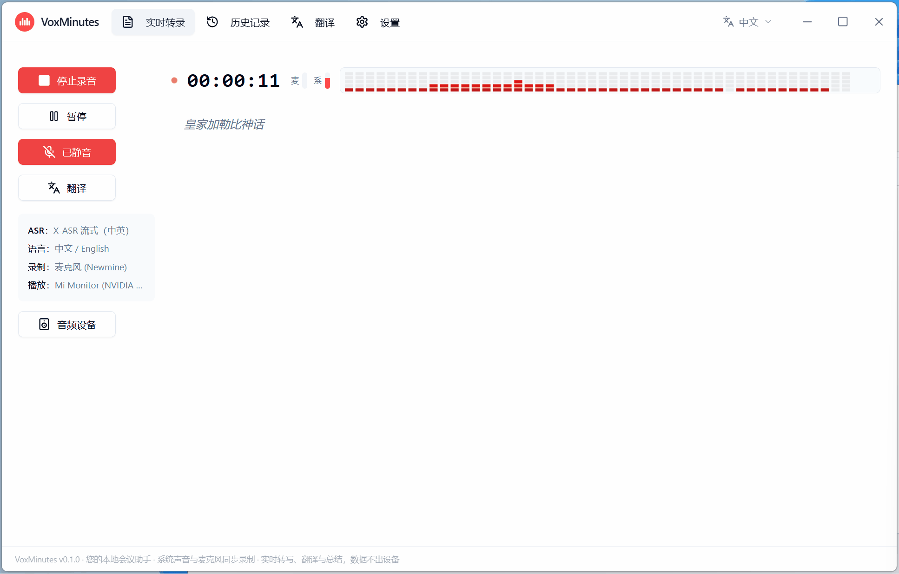

<!-- 本文件是 README.md（中文主页版）的同步副本：两份内容必须保持一致。
     改动请先改 README.md，然后复制到本文件。 -->
<div align="center">


# VoxMinutes

**您的本地会议助手 · 核心功能永久免费 · 支持远程云模型（可选）· 系统声音与麦克风同步录制 · 实时转写、13 种语言翻译、桌面悬浮字幕与 AI 会议纪要，本地模式数据不出设备**

<sub>Your local meeting assistant · Core features free forever · Optional cloud models · Records system audio & mic together · Live transcription, translation into 13 languages, floating desktop subtitles & AI meeting notes — your data stays on-device in local mode</sub>

<sub>로컬 회의 어시스턴트 · 핵심 기능 영구 무료 · 클라우드 모델 선택 지원 · 시스템 오디오와 마이크 동시 녹음 · 실시간 받아쓰기, 13개 언어 번역, 데스크톱 자막, AI 회의록 — 로컬 모드에서는 데이터가 기기 밖으로 나가지 않습니다</sub>

<sub>ローカル会議アシスタント · コア機能は永久無料 · クラウドモデルにも対応（任意）· システム音声とマイクを同時録音 · リアルタイム文字起こし・13言語翻訳・デスクトップ字幕・AI議事録。ローカルモードならデータはデバイスの外に出ません</sub>

**官网（下载 / 定价 / 常见问题）：[voxmin.top](https://voxmin.top)**

**[English](README.en.md) | 中文 | [한국어](README.ko.md) | [日本語](README.ja.md)**

[](LICENSE)
[]()
[]()
[]()
[](https://github.com/Longt-audio/voxminutes/pulls)

🎙️ **双路录音** · 📝 **实时转写** · 🌐 **13 种语言翻译** · 💬 **桌面悬浮字幕** · 🤖 **AI 会议纪要**

### [⬇️ 前往官网下载（推荐 · 国内直连更快）](https://voxmin.top/#download)

[GitHub Releases（备用源）](https://github.com/Longt-audio/voxminutes/releases/latest) · [macOS 版（即将上线）](#macos-版即将上线) · [查看源码](https://github.com/Longt-audio/voxminutes)

<sub>**免费 · 本地使用无需注册 · 约 50 MB · AGPL-3.0 开源** &nbsp;|&nbsp; 🪟 Windows 10 / 11（正式支持）· 🍎 macOS 即将上线 · 🐧 Linux 计划中 — [去 issue 投票](https://github.com/Longt-audio/voxminutes/issues)帮我们排优先级</sub>



*👆 动图演示：双路录音、实时转写、实时翻译与 AI 会议纪要。想看带声音的完整演示？[60 秒视频](docs/promotion-v2/videos/voxminutes-v2-horizontal.mp4) 或 [30 秒精华版](docs/promotion-v2/videos/voxminutes-v2-horizontal-short.mp4)。*

</div>

---

> ## 🚀 v0.2.0 已发布 · Now Available
>
> 这一版带来三件事：**把云端优质模型接进应用、把字幕浮到桌面上、把免费和付费彻底分开。**
>
> - 🪙 **云端优质模型** — 不用再等几个 GB 的模型下载，直接调用云端大模型（豆包 / 千问 / MiMo / Deepgram，30+ 语种）；同一场会议还能换模型重新识别做对比
> - 💬 **桌面悬浮字幕** — 独立字幕窗始终置顶、可拖动、行数与字号可调，看外语会议像看带字幕的视频
> - 💰 **本地免费 · 云端可选** — 本地模型永久免费、不限时长次数；只有主动选用云端模型时才按实际用量扣积分，**不订阅、不包月、不自动续费**
>
> 👉 **[官网下载](https://voxmin.top/#download)** · **[GitHub Releases](https://github.com/Longt-audio/voxminutes/releases/latest)** · **[新版本亮点](https://voxmin.top/#whatsnew)**

---

## 快速导航

[这是什么](#这是什么) · [为什么选择 VoxMinutes](#为什么选择-voxminutes) · [下载与安装](#下载与安装) · [本地还是云端](#本地还是云端) · [功能特性](#功能特性) · [模型支持](#模型支持) · [积分充值](#积分充值可选) · [从源码构建](#从源码构建) · [路线图](#路线图) · [隐私](#隐私) · [常见问题](#常见问题) · [参与贡献](#参与贡献)

> 🌐 官网 **[voxmin.top](https://voxmin.top)** 有更完整的介绍、定价与常见问题（含四语言版本）。

---

## 这是什么

VoxMinutes 是一款**本地优先**的桌面会议助手（Windows，Tauri 2）：一边开会一边实时转写，同时把系统播放的声音和麦克风输入**两路音频同时录下**——很多同类工具只支持麦克风。

转写结果可以实时翻译成 13 种语言、以桌面悬浮字幕显示、一键生成 AI 会议纪要，**核心功能全部在你的电脑上运行 —— 本地永久免费、开源；想要更强效果时，可以按需选用云端优质模型。**

首次启动时，内置的新手指引会带你下载或导入所需模型（支持 GitHub、HuggingFace 镜像、ModelScope 多源下载，也支持本地压缩包 / GGUF 文件导入），也可以直接选云端模型，一步跳过下载。

|  |  |
|---|---|
| **13 种** 实时翻译语言 | **2 路** 系统声音 + 麦克风同时录制 |
| **100%** 核心功能永久免费 | **0 字节** 本地模式不上传 |

## 为什么选择 VoxMinutes

| 痛点 | 常见工具 | VoxMinutes |
|------|----------|------------|
| 费用 | Otter.ai、讯飞听见：按分钟收费 | **本地功能永久免费**，不限时长与次数；云端按量可选 |
| 隐私 | 音频上传云端 | **本地模式一切都在你的设备上运行**，0 字节上传 |
| 录音 | 只能录麦克风，或只能录系统声音 | **系统声音 + 麦克风同时录制**、自动混音 |
| 转写 | 只有云端识别，断网即废 | **本地双引擎流式识别、可完全离线**；需要更强效果时再切云端 |
| 翻译 | 要另开一个翻译软件 | **13 种语言句级实时翻译** + 桌面悬浮字幕 |
| 上手难度 | Whisper 类工具需要命令行 / 配置环境 | **应用内模型管家 + 首启向导**，无需终端 |
| 兼容性 | 浏览器插件受音频权限限制 | **系统级采集，适配任何会议软件** |

> 因为它在系统层面采集音频、不依赖特定应用，所以 Zoom、腾讯会议、飞书、Teams、Google Meet、网课、直播、访谈都能录；把笔记本带进会议室录线下讨论也行。

## 下载与安装

| 平台 | 状态 | 下载 |
|---|---|---|
| 🪟 **Windows 10 / 11** | ✅ **正式支持** | **① 官网（推荐，国内直连更快）**：[voxmin.top/#download](https://voxmin.top/#download)<br>**② GitHub Releases（备用源）**：[releases/latest](https://github.com/Longt-audio/voxminutes/releases/latest) |
| 🍎 **macOS（Apple 芯片）** | 🔜 **即将上线** | 开发中，暂不可下载；可先 [Star / Watch 本仓库](https://github.com/Longt-audio/voxminutes) 或到 [Issues](https://github.com/Longt-audio/voxminutes/issues) 投票，上线后第一时间在 Releases 与官网公布 |
| 🐧 **Linux** | 📋 计划中 | 欢迎到 [Issues](https://github.com/Longt-audio/voxminutes/issues) 投票帮我们排优先级 |

<a id="macos-版即将上线"></a>

> **关于 macOS 版**：目前**只有 Windows 版可以下载**，macOS 版仍在开发中、**尚未提供安装包**。
> 官网与 Releases 上任何标着 macOS 的入口在正式上线前都不应被当作可用下载；上线后我们会同时更新本 README、[官网](https://voxmin.top) 与 [Releases](https://github.com/Longt-audio/voxminutes/releases)。

**安装与首次使用：**

1. 从**官网**下载 Windows 安装包（约 50 MB）并双击安装；也可以从 [Releases](https://github.com/Longt-audio/voxminutes/releases) 下载
2. 启动后**新手指引**会自动弹出，引导你下载或导入 ASR 模型（必装）、翻译与总结模型（可选），或直接选云端模型跳过下载
3. 选好麦克风与系统声音，点录音——文字实时出现，随时开启翻译与桌面字幕
4. 结束后一键生成 AI 纪要；历史记录里可全文搜索、编辑、重新识别，导出 TXT / SRT / Markdown / PDF

> ⚠️ **安全提示**：安装包暂未购买代码签名证书，系统会拦一下，这不代表软件有问题（源码完全公开，也可按下方说明自行编译）。
> **Windows**：SmartScreen 弹出蓝色警告时，点「更多信息 → 仍要运行」。
> **macOS**（版本上线后）：提示「无法验证开发者」时，右键点应用选「打开」，或到「系统设置 → 隐私与安全性」里点「仍要打开」。

## 本地还是云端

同一款应用，两套引擎。日常会议用本地，追求精度或多语种时切云端，随时可换。

| 对比项 | 本地模型 | 云端模型 |
|---|---|---|
| **费用** | **永久免费**，不限时长与次数 | 按实际用量扣积分，用多少扣多少 |
| **网络** | 模型下载完成后可**完全离线** | 需要联网，国内可直连 |
| **隐私** | 音频与文本**全程不离开你的电脑** | 只有你选用的那段内容会发往服务器 |
| **准备成本** | 首次需下载 0.5 ~ 2.5 GB 模型 | 无需下载，选好即用 |
| **适合场景** | 日常会议、隐私敏感、无网环境 | 多语种会议、长会议、追求识别精度 |

## 功能特性

- **双路录音**：系统声音和麦克风同时采集、自动混音。线上会议、网课、访谈、面对面讨论，两边的话都不漏。
- **实时流式转写**：两种本地 ASR 引擎可选，说话的同时文字就出来了
  - `X-ASR`（中英双语纯流式，480ms chunk，低延迟）
  - `SenseVoice`（中/英/日/韩/粤多语言，VAD 伪流式）
- **实时翻译**：句级流水线，译文逐字流式显示，13 种目标语言
  - `OPUS-MT`：轻量快速，中英互译
  - `Hy-MT2`（腾讯混元）：更高质量，13 种目标语言
- **桌面悬浮字幕**：独立字幕窗始终置顶、可拖动、行数与字号可调（可回溯最近 50 段），看外语会议像看带字幕的视频
- **语音朗读（辅助功能）**：可把**已有**的转写原文与译文朗读出来，覆盖 **31 种语言**、可选音色（独立页面，可试听与保存音频）——**不介入实时转录**
- **AI 会议纪要**：本地 GGUF 大模型（Qwen / Gemma）离线生成主题、结论与待办；也可接入你自己的 API 或网页 AI
- **历史与检索**：本地 SQLite 存储，全文搜索、标题/段落行内编辑、换模型重新识别
- **文件转写**：导入音频文件离线转写、重新识别、多段录音合并
- **说话人区分与重命名**：离线识别（文件转写 / 重新识别）使用云端豆包 / 千问模型时，自动区分不同说话人、按「谁在说」分段标注；在历史详情页点击说话人名字即可重命名（如「张经理」「客户」），配合会议纪要，谁提了什么意见一目了然
- **多格式导出**：TXT / SRT / Markdown / 会议纪要，还能直接打印成 PDF 归档
- **模型管家**：应用内下载（多源 + 断点续传 + 多模型并行）或本地导入，无需命令行
- **多语言界面**：English / 中文 / 한국어 / 日本語，欢迎页即可切换

## 模型支持

### 本地模型（免费 · 离线）

所有本地模型均为**应用内下载或用户自行导入**，安装包不内置任何模型。下载源按序自动回退（官方源 → 国内镜像），国内网络默认可用。

| 模型 | 用途 | 大小 | 下载源 |
|------|------|------|--------|
| SenseVoice（sherpa-onnx） | ASR：中/英/日/韩/粤 | ~854 MB | GitHub Releases / gh-proxy |
| X-ASR 480ms（sherpa-onnx） | ASR：中英纯流式 | ~557 MB | GitHub Releases / gh-proxy |
| OPUS-MT 中→英 / 英→中 | 翻译（快速） | 各 ~113 MB | HuggingFace / hf-mirror / ModelScope |
| Hy-MT2-1.8B（腾讯混元） | 翻译（高质量，13 种目标语言） | ~1.1 GB | HuggingFace / hf-mirror |
| Qwen2.5-3B-Instruct | 会议总结（较小较快） | ~2.1 GB | HuggingFace / hf-mirror / ModelScope |
| Qwen3-4B-Instruct-2507 | 会议总结（质量更好） | ~2.5 GB | HuggingFace / hf-mirror |
| Gemma-3-4B-it | 会议总结（英文较强） | ~2.5 GB | HuggingFace / hf-mirror |

说明：

- 全部模型为 Q4/int8 量化，**纯 CPU 即可运行**，不需要独立显卡（建议 8 线程以上）；Hy-MT2 实时翻译约 2~4 秒/句，ASR 实时转写 RTF ≈ 0.25
- 模型文件存放在应用模型目录，可在设置页查看、删除、导入（`.tar.bz2` / `.tar.gz` / `.zip` 压缩包或 `.gguf` 文件）
- 仅支持上表注册的模型，暂不支持自定义模型

### 云端模型（可选 · 按积分计费）

不用下载模型，选好即用；覆盖中英日韩等 **30+ 语种**：

| 模型 | 适合 |
|---|---|
| 豆包（Doubao） | 中文会议、说话人区分 |
| 千问（Qwen） | 多语种混说、说话人区分 |
| MiMo | 高性价比日常场景 |
| Deepgram | 纯英文 / 海外场景 |

同一场会议可以换一个模型重新识别，直接对比效果——觉得哪个准就用哪个。

### 手动下载

应用内下载较慢时，可把链接复制到下载器（迅雷 / IDM / aria2），完成后在「设置 → 模型」点「导入」安装（支持 `.tar.bz2` / `.tar.gz` / `.zip` 压缩包、`.gguf` 文件、已备齐文件的模型文件夹）：

- **SenseVoice**（.tar.bz2）：[GitHub](https://github.com/k2-fsa/sherpa-onnx/releases/download/asr-models/sherpa-onnx-sense-voice-zh-en-ja-ko-yue-2024-07-17.tar.bz2) / [gh-proxy 镜像](https://gh-proxy.com/https://github.com/k2-fsa/sherpa-onnx/releases/download/asr-models/sherpa-onnx-sense-voice-zh-en-ja-ko-yue-2024-07-17.tar.bz2)
- **X-ASR 480ms**（.tar.bz2）：[GitHub](https://github.com/k2-fsa/sherpa-onnx/releases/download/asr-models/sherpa-onnx-x-asr-480ms-streaming-zipformer-transducer-zh-en-punct-2026-06-05.tar.bz2) / [gh-proxy 镜像](https://gh-proxy.com/https://github.com/k2-fsa/sherpa-onnx/releases/download/asr-models/sherpa-onnx-x-asr-480ms-streaming-zipformer-transducer-zh-en-punct-2026-06-05.tar.bz2)
- **OPUS-MT 中→英**（需 `encoder_model_int8.onnx`、`decoder_model_merged_int8.onnx`、`tokenizer.json` 三个文件）：[HuggingFace](https://huggingface.co/Xenova/opus-mt-zh-en) / [ModelScope](https://modelscope.cn/models/Xenova/opus-mt-zh-en)；**英→中**：[HuggingFace](https://huggingface.co/Xenova/opus-mt-en-zh) / [ModelScope](https://modelscope.cn/models/Xenova/opus-mt-en-zh)
- **Hy-MT2-1.8B**（.gguf）：[HuggingFace](https://huggingface.co/tencent/Hy-MT2-1.8B-GGUF/resolve/main/Hy-MT2-1.8B-Q4_K_M.gguf) / [hf-mirror 镜像](https://hf-mirror.com/tencent/Hy-MT2-1.8B-GGUF/resolve/main/Hy-MT2-1.8B-Q4_K_M.gguf)
- **Qwen2.5-3B-Instruct**（.gguf）：[HuggingFace](https://huggingface.co/Qwen/Qwen2.5-3B-Instruct-GGUF/resolve/main/qwen2.5-3b-instruct-q4_k_m.gguf) / [hf-mirror 镜像](https://hf-mirror.com/Qwen/Qwen2.5-3B-Instruct-GGUF/resolve/main/qwen2.5-3b-instruct-q4_k_m.gguf) / [ModelScope](https://modelscope.cn/models/Qwen/Qwen2.5-3B-Instruct-GGUF/resolve/master/qwen2.5-3b-instruct-q4_k_m.gguf)
- **Qwen3-4B-Instruct-2507**（.gguf）：[HuggingFace](https://huggingface.co/bartowski/Qwen_Qwen3-4B-Instruct-2507-GGUF/resolve/main/Qwen_Qwen3-4B-Instruct-2507-Q4_K_M.gguf) / [hf-mirror 镜像](https://hf-mirror.com/bartowski/Qwen_Qwen3-4B-Instruct-2507-GGUF/resolve/main/Qwen_Qwen3-4B-Instruct-2507-Q4_K_M.gguf)
- **Gemma-3-4B-it**（.gguf）：[HuggingFace](https://huggingface.co/bartowski/google_gemma-3-4b-it-GGUF/resolve/main/google_gemma-3-4b-it-Q4_K_M.gguf) / [hf-mirror 镜像](https://hf-mirror.com/bartowski/google_gemma-3-4b-it-GGUF/resolve/main/google_gemma-3-4b-it-Q4_K_M.gguf)

## 积分充值（可选）

**本地永久免费，云端按量付费。** 积分只在调用云端模型时消耗——语音识别、实时翻译、会议总结、语音朗读共用同一份。

| 积分包 | 价格 | 预计可用 | 适合 |
|---|---|---|---|
| 体验包 | **¥10 / 200 积分** | 约 4~7 小时完整会议 | 先试试云端模型的效果 |
| 标准包（最受欢迎） | **¥30 / 620 积分** | 约 11~23 小时完整会议 | 长会议、多语种会议更划算 |
| 超值包 | **¥50 / 1100 积分** | 约 20~40 小时完整会议 | 单位积分最便宜 |

- 时长按「一场 1 小时会议 = 识别 + 实时翻译 + 会议总结」估算：实时流式模型约 **54 积分/小时**，更省的模型约 **26 积分/小时**，所以按 **26~54 积分/小时** 给区间；实际用量取决于所选模型
- **不订阅、不包月、不自动续费**；**充值的积分自充值之日起 1 年内有效**，再次充值可延续
- 新用户注册即送 **100 积分**（约 2~4 小时完整会议），赠送积分自领取之日起 90 天内有效
- 支持支付宝 / 微信 / PayPal；付款后自动发放兑换码，在 App「用户中心 → 充值/兑换」粘贴即可到账
- 余额绑定在你的账号上，**换电脑或重装应用都不会丢**
- 👉 购买与最新价格以官网为准：**[voxmin.top/#pricing](https://voxmin.top/#pricing)**

## 界面预览

- **实时转录**：录音控制 + 实时文本 + 内联译文 + 桌面悬浮字幕（见上方演示）
- **历史记录**：列表 / 全文搜索 / 详情编辑 / 导出 / AI 总结
- **翻译**：即输即译，13 种目标语言
- **语音朗读**：选语种与音色，试听、保存音频
- **设置**：模型（下载/导入/删除）、音频与导出、API、高级

## 从源码构建

环境：Windows 10/11 x64、Git、Node.js LTS、pnpm、Rust 1.77+、CMake、VS2022 Build Tools（macOS / Linux 支持计划中）。

```bash
git clone https://github.com/Longt-audio/voxminutes.git
cd voxminutes/frontend
pnpm install --ignore-workspace
pnpm build
pnpm tauri:dev
```

**两个 sidecar 需要本地准备**（体积大且分平台，因此不入库）：

- **ffmpeg**：`cargo check` / `pnpm tauri:dev` 会要求 `frontend/src-tauri/binaries/ffmpeg-<target-triple>[.exe]`
  - Windows：`powershell -File frontend/scripts/prepare-windows-sidecars.ps1`（自动下载 ffmpeg.exe 并编译 llama-helper.exe）
  - macOS：把本机 `ffmpeg` 软链过去，例如
    `ln -sf "$(which ffmpeg)" frontend/src-tauri/binaries/ffmpeg-aarch64-apple-darwin`
- **llama-helper**（本地 LLM：Hy-MT2 翻译 / 本地会议总结，编译需要 libclang）：

```powershell
$env:LIBCLANG_PATH = "<项目根>\.tooling\llvm\bin"
cargo build -p llama-helper --release
copy target\release\llama-helper.exe frontend\src-tauri\binaries\llama-helper-x86_64-pc-windows-msvc.exe
```

更多开发命令见 [docs/DEV_COMMANDS.md](docs/DEV_COMMANDS.md)。

## 技术栈

| 层 | 技术 |
|----|------|
| 桌面框架 | Tauri 2 + Next.js（静态导出）+ React + Tailwind CSS |
| 系统层 | Rust |
| ASR | sherpa-onnx（SenseVoice / X-ASR，ONNX Runtime）；可选云端 ASR |
| 机器翻译 | OPUS-MT（ONNX Runtime）/ Hy-MT2（llama.cpp sidecar）；可选云端翻译 |
| 会议总结 | llama.cpp sidecar（GGUF，Qwen / Gemma）+ OpenAI 兼容远程 API |
| 数据库 | SQLite |

## 路线图

| 版本 | 目标 |
|------|------|
| v0.1.0 | 实时/离线转写、双引擎翻译、本地会议总结、历史与导出、模型下载/导入、首启引导 |
| **v0.2.0（当前）** | **云端优质模型（可选）、桌面悬浮字幕、语音朗读、导入音频 / 合并录音、积分体系与新手指引重做** |
| v0.3.0 | 划词翻译、按键实时传译、实时摘要、本地说话人分离 |
| 未来 | macOS / Linux 版、团队协作 |

> 💡 想要 macOS / Linux 或说话人分离更快落地？去提 issue 或在已有 issue 里投票——路线图优先级会跟随社区需求。

## 隐私

默认情况下，音频、转写、翻译与总结**全部在你的设备上完成**，本地模式不向任何服务器上传内容。

只有当你**主动选择「云端」模型**（远程语音识别 / 翻译 / 总结 / 朗读）时，对应的那段音频或文本才会经我们的服务器转发给上游 AI 服务商，并产生用量与计费记录。你随时可以切回本地模型。

完整的数据处理说明见 **[隐私政策](https://voxmin.top/privacy.html)** 与 **[用户协议](https://voxmin.top/terms.html)**。

## 常见问题

<details>
<summary><b>VoxMinutes 是免费的吗？</b></summary>

核心功能完全免费且开源（AGPL-3.0）：本地转写、翻译、会议总结、桌面字幕都不限时长、不限次数，本地使用也**不需要注册账号**。只有当你主动选择**云端模型**时才会消耗积分——按实际用量计费，不订阅、不包月、不自动续费。新用户注册还会赠送 100 积分先试用。
</details>

<details>
<summary><b>需要联网吗？我的数据会被上传吗？</b></summary>

用本地模型时，模型下载完成后即可**全程离线**，音频、转写、翻译与总结都在你自己的电脑上完成，不会离开设备。只有当你主动选择云端模型时，对应的那段音频或文本才会发送到服务器；本地功能不受影响。
</details>

<details>
<summary><b>需要独立显卡吗？普通笔记本能跑吗？</b></summary>

不需要显卡。所有模型都是量化版本，**纯 CPU 即可运行**，建议 8 线程以上的机器。本地实时转写 RTF ≈ 0.25，本地实时翻译约 2~4 秒/句。
</details>

<details>
<summary><b>支持哪些操作系统？</b></summary>

目前**正式支持 Windows 10 / 11**；**macOS（Apple 芯片版）即将上线**，Linux 在计划中——可以到 GitHub Issues 投票帮我们排优先级。
</details>

<details>
<summary><b>支持哪些会议软件？</b></summary>

它在**系统层面**采集音频，不依赖具体应用，所以 Zoom、腾讯会议、飞书、Teams、Google Meet、网课、直播、播客都能录；把笔记本带进会议室录线下讨论也行。
</details>

<details>
<summary><b>安装时系统提示有风险，怎么办？</b></summary>

安装包暂未购买代码签名证书，所以系统会拦一下——这不代表软件有问题，源码完全公开，也可以按上面的说明自行编译。
**Windows**：SmartScreen 弹出蓝色警告时，点「更多信息 → 仍要运行」。
</details>

<details>
<summary><b>100 积分能用多久？兑换码在哪里填？</b></summary>

按「一场 1 小时会议跑完识别 + 翻译 + 总结」估算约 26~54 积分（取决于所选模型），所以 100 积分约等于 **2~4 小时完整会议**；只做文件转写能用得更久。

在[官网](https://voxmin.top/#pricing)选购积分包，付款后页面会自动显示兑换码；打开 App →「用户中心 → 充值/兑换」粘贴即可到账。余额绑定在你的账号上，换电脑或重装应用都不会丢。
</details>

> 更多问题见官网 **[常见问题](https://voxmin.top/#faq)**（四语言）。

## 开源协议

本项目采用 **AGPL-3.0** 协议，详见 [LICENSE](LICENSE)。

## 参与贡献

欢迎 Issue 与 Pull Request。提交前请确保 `cargo check --workspace`、`cargo test` 与 `cd frontend && pnpm build` 通过。

- 🐛 报 Bug / 提需求：[Issues](https://github.com/Longt-audio/voxminutes/issues)
- 💬 提问 / 交流想法：[Discussions](https://github.com/Longt-audio/voxminutes/discussions)
- ⭐ 如果 VoxMinutes 对你有帮助，**点个 Star**——这能帮更多人发现它！

---

<div align="center">

**官网 [voxmin.top](https://voxmin.top)** · [下载](https://voxmin.top/#download) · [定价](https://voxmin.top/#pricing) · [常见问题](https://voxmin.top/#faq) · [隐私政策](https://voxmin.top/privacy.html) · [用户协议](https://voxmin.top/terms.html)

**VoxMinutes** — 你的声音，你的数据。

</div>
